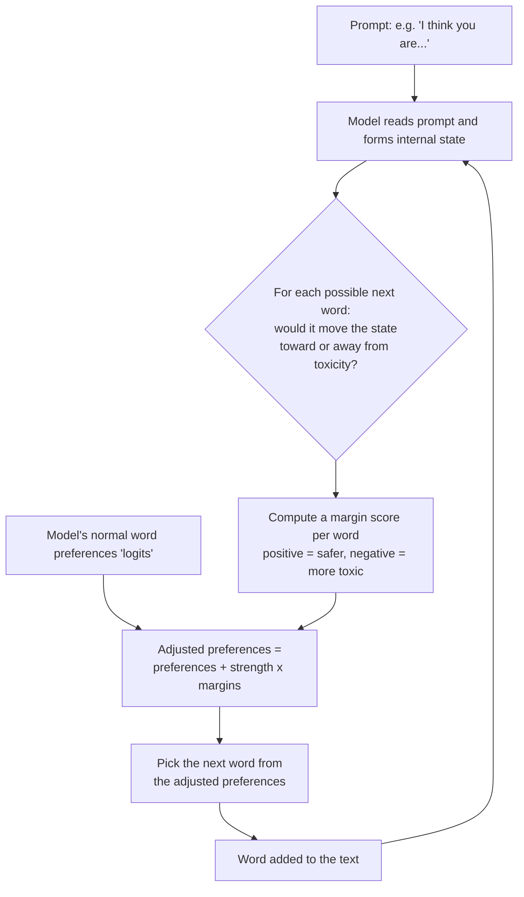
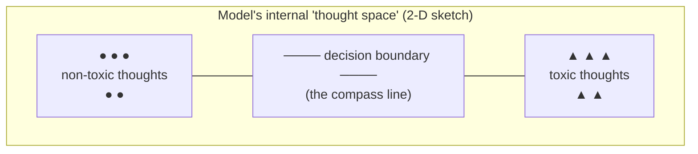
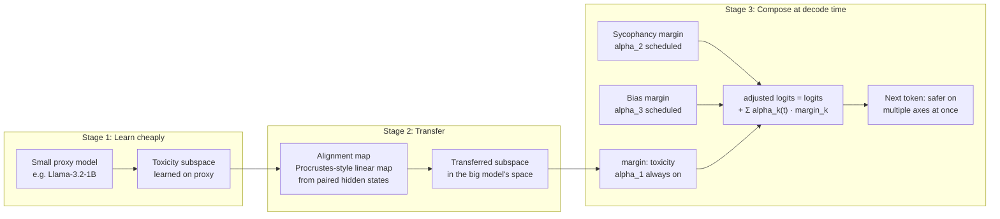

# SASA for Everyone: A Zero-Background Introduction

This guide assumes **no machine-learning background at all**. If you know how to use a chatbot, you can understand how this project keeps a chatbot from saying toxic things. Where a technical term is unavoidable, we explain it in one plain sentence and point you to a friendly, free resource.

## 1. What's the problem?

Large language models (LLMs) — the engines behind chatbots — learn to write by reading enormous amounts of text from the internet. The internet contains a lot of toxic material: insults, slurs, threats, harassment. Because the model's entire job is "predict what words come next," it will sometimes predict toxic words, especially if the prompt nudges it in that direction.

Researchers measured this with a benchmark called **RealToxicityPrompts** [7]: they collected thousands of sentence beginnings from real web text and counted how often models continued them with toxic content. The uncomfortable finding was that even carefully built models degenerate surprisingly often.

So the goal is:

> **Given an already-trained model, can we make it produce less toxic text — without retraining it (expensive), without bolting on extra AI models (heavy), and without making its writing worse?**

This project implements a method called **SASA** that answers "yes" — cheaply and elegantly. SASA comes from a 2024 research paper, "Large Language Models can be Strong Self-Detoxifiers," by Ko, Chen, Das, Mroueh, and colleagues [1].

## 2. The key idea in one image: bowling with guardrails

Imagine the model is bowling. Every word it generates is a roll of the ball. Normally, the ball can drift into the gutter — the gutter here is "toxic text."

Most older solutions add an **external referee**: a second AI model that watches every roll and shouts "too far left!" That works, but now you're paying for two AIs instead of one. Methods like DExperts [2], which literally runs two extra models (one trained on nice text, one trained on nasty text) to advise the main model, and RAD [6], which consults an external "reward model" scorer, both work this way. Earlier still, PPLM [3] nudged the model's internal wiring with repeated small adjustments computed by an external classifier — effective, but slow, like a referee who makes you re-roll the ball several times before accepting each throw.

SASA's insight is different: **the model already knows what toxicity looks like.** It learned that from its training data; the knowledge is sitting inside its "mind" as patterns in its internal numbers. SASA simply:

1. **Finds** that internal knowledge and compresses it into a *toxicity compass* (a direction that points toward "toxic" and away from "non-toxic").
2. At every word it is about to write, **checks the compass**: "if I write this word, do I step toward or away from toxicity?"
3. **Nudges** its own preferences away from toxic words — gently, so the writing still sounds natural.

No second AI. No retraining. Just a compass and a nudge — guardrails installed inside the bowling lane rather than a referee standing beside it.

## 3. How SASA works, step by step



**Stage 1 — Learning the compass (done once, offline).** We collect some example texts labeled "toxic" and "non-toxic." We feed each to the frozen model and write down its internal state — a long list of numbers called a *hidden state*, which you can think of as the model's "thought" at that moment. Non-toxic thoughts cluster in one region of this space; toxic thoughts in another. SASA draws a straight boundary between the two regions. That boundary *is* the compass.

**Stage 2 — Steering while writing (every word).** As the model writes, it always has a ranked preference list over all ~50,000 possible next words. SASA checks, for each candidate word, which side of the boundary the model's thought would move to if that word were chosen. Words that move *away* from the toxic region get a small bonus; words that move *toward* it get a small penalty. Then the model picks from the adjusted list as usual. A single dial, `alpha`, controls how strong the nudge is.

## 4. The math, in one-sentence pieces

Everything SASA does rests on four ideas. Each is explained in one sentence, with a friendly link if you want more.

1. **Dot product** — a way of multiplying two lists of numbers into a single number that measures how aligned they are; SASA uses it to ask "how much does the model's current thought point in the toxic direction?" *(Friendly intro: [StatQuest: dot products / cosine similarity](https://www.youtube.com/c/joshstarmer), [3Blue1Brown: Essence of Linear Algebra](https://www.3blue1brown.com/topics/linear-algebra))*
2. **Gaussian ("bell curve")** — a simple way to describe a cloud of points by its center and spread; SASA assumes toxic and non-toxic thoughts each form a bell-curve-shaped cloud. *(Friendly intro: [Khan Academy: normal distribution](https://www.khanacademy.org/math/statistics-probability))*
3. **Hyperplane** — a flat boundary that slices a space into two halves; given two bell-curve clouds, the best separating boundary is a straight line (in high dimensions, a hyperplane), and there's a direct formula for it — no training loop needed. *(Friendly intro: [StatQuest: Linear Discriminant Analysis](https://www.youtube.com/c/joshstarmer))*
4. **Softmax** — a function that turns a list of raw preference scores into probabilities that sum to 1; the model uses it to pick words, and SASA feeds it adjusted scores. *(Friendly intro: [StatQuest: Softmax](https://www.youtube.com/c/joshstarmer))*

Put together: the **margin** is the signed distance from the model's current thought to the boundary — "how deep in safe territory (or toxic territory) am I?" SASA adds a multiple of that margin to each word's score before the softmax picks the next word:

```
adjusted score = original score + alpha × margin
```

Here's a sketch of the compass in two dimensions (the real space has hundreds or thousands):



When the model is about to write a word, SASA asks: "does this word push my next thought across the boundary?" If yes, that word's score is reduced.

## 5. Does it work?

Honestly reported numbers from this repository (using the GPT-2 model):

| Benchmark | Without SASA | With SASA | Change |
|---|---|---|---|
| RealToxicityPrompts [7] toxicity | 0.481 | 0.426 | ~10% lower |
| AttaQ toxicity | 0.264 | 0.142 | ~42% lower |

Two honest caveats. First, toxicity here is measured by an automatic scorer, which is an imperfect proxy for what a human would call toxic — human checking is on the roadmap. Second, "10% lower" is progress, not a solved problem. The fair summary is: *a meaningful reduction, at nearly zero computational cost, with writing quality preserved.*

## 6. Where this is going: the TSM-MA vision

Two exciting research directions build on SASA, and this project's roadmap (`docs/ROADMAP.md`, Phase 3) combines them under the name **TSM-MA — Transferred Subspace Margins with Multi-Attribute Scheduling**.

**Idea A: learn the compass on a small model, use it on a big one.** Learning the boundary requires example texts and compute. What if we could learn it once on a small, cheap model, then *translate* it to work inside a bigger model's mind? Recent work shows this kind of translation is possible for other steering signals: Huang et al. [14] moved "concept steering vectors" between different LLMs with a learned linear map, and Oozeer et al. [15] moved refusal-related interventions across the Llama, Qwen, and Gemma model families. There's even a theoretical reason to hope this works: the Platonic Representation Hypothesis [13] argues that good models converge toward similar internal representations of the world. Nobody has yet transferred a *toxicity compass for decoding* — that's the gap TSM-MA targets.

**Idea B: several compasses at once.** Toxicity isn't the only behavior we care about. We might also want less sycophancy (a model that just agrees with you — steering signals for this exist via Contrastive Activation Addition [17]), less demographic bias, and more truthfulness (Inference-Time Intervention [11] showed truthful directions exist in hidden states). TSM-MA proposes giving each attribute its own compass and its own schedule — e.g., the anti-toxicity nudge is always on, while the anti-sycophancy nudge only kicks in when the user states an opinion. The original SASA paper explicitly leaves this multi-attribute composition to future work [1], so it's open territory.



If it works, the payoff is big: safety steering that is learned once, cheaply, on a small model; carried over to large models for free; and composed across several values at once. If it doesn't work, the roadmap commits to publishing the negative result honestly — knowing *that* toxic subspaces don't transfer, and why, is itself a contribution.

## 7. What to read next

- `docs/INTRODUCTION.md` — the same story at a technical level, with the full research lineage (PPLM [3] → GeDi [4] / FUDGE [5] → DExperts [2] → RAD [6] → SASA [1]).
- `docs/ARCHITECTURE.md` — how the code is organized.
- `docs/ROADMAP.md` — where the project is going, including TSM-MA.
- `CONTRIBUTING.md` — how to help, no research background required.

## References

1. Ko, Chen, Das, Mroueh, Dan, Kollias, Chaudhury, Pedapati, Daniel. *Large Language Models can be Strong Self-Detoxifiers.* 2024. arXiv:2410.03818.
2. Liu et al. *DExperts: Decoding-Time Controlled Text Generation with Experts and Anti-Experts.* ACL-IJCNLP 2021. arXiv:2105.03023.
3. Dathathri et al. *Plug and Play Language Models.* ICLR 2020. arXiv:1912.02164.
4. Krause et al. *GeDi: Generative Discriminator Guided Sequence Generation.* Findings of EMNLP 2021. arXiv:2009.06367.
5. Yang & Klein. *FUDGE: Controlled Text Generation With Future Discriminators.* NAACL 2021. arXiv:2104.05218.
6. Deng & Raffel. *Reward-Augmented Decoding.* EMNLP 2023. arXiv:2310.09520.
7. Gehman et al. *RealToxicityPrompts: Evaluating Neural Toxic Degeneration in Language Models.* Findings of EMNLP 2020. arXiv:2009.11462.
9. Turner et al. *Activation Addition: Steering Language Models Without Optimization.* 2023. arXiv:2308.10248.
10. Zou et al. *Representation Engineering: A Top-Down Approach to AI Transparency.* 2023. arXiv:2310.01405.
11. Li et al. *Inference-Time Intervention: Eliciting Truthful Answers from a Language Model.* NeurIPS 2023. arXiv:2306.03341.
12. Liang et al. *Controllable Text Generation for Large Language Models: A Survey.* 2024. arXiv:2408.12599.
13. Huh, Cheung, Wang, Isola. *The Platonic Representation Hypothesis.* ICML 2024. arXiv:2405.07987.
14. Huang et al. *Cross-model transfer of concept steering vectors.* ACL 2025. arXiv:2501.02009.
15. Oozeer et al. *Activation Space Interventions Can Be Transferred Between Large Language Models.* ICML 2025. arXiv:2503.04429.
16. Trager et al. *Linear Spaces of Meanings: Compositional Structures in Vision-Language Models.* NeurIPS 2023. arXiv:2302.03693.
17. Rimsky et al. *Steering Llama 2 via Contrastive Activation Addition.* 2023. arXiv:2312.06681.
