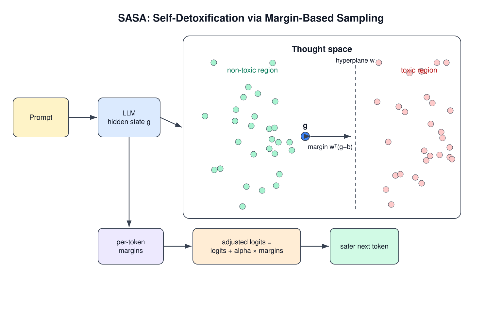
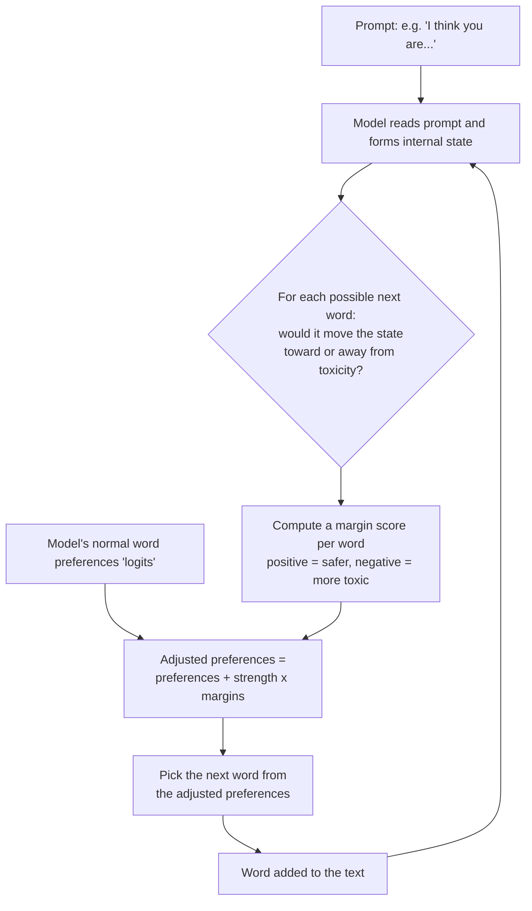
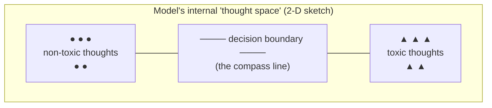
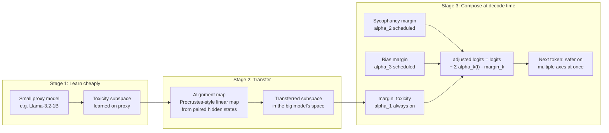

# SASA for Everyone: A Zero-Background Introduction

This guide assumes **no machine-learning background and no math beyond
arithmetic**. Every technical idea is introduced the same way: first a tiny
example with real numbers you can check by hand, then the intuition, then the
notation as shorthand for the procedure you just saw. If you know how to use
a chatbot, you can understand how this project keeps a chatbot from saying
toxic things.

## 1. What's the problem?

Large language models (LLMs) — the engines behind chatbots — learn to write
by reading enormous amounts of text from the internet. The internet contains
a lot of toxic material: insults, slurs, threats, harassment. Because the
model's entire job is "predict what words come next," it will sometimes
predict toxic words, especially if the prompt nudges it in that direction.

Researchers measured this with a benchmark called **RealToxicityPrompts**
[7]: they collected thousands of sentence beginnings from real web text and
counted how often models continued them with toxic content. The uncomfortable
finding was that even carefully built models degenerate surprisingly often.

So the goal is:

> **Given an already-trained model, can we make it produce less toxic text —
> without retraining it (expensive), without bolting on extra AI models
> (heavy), and without making its writing worse?**

This project implements a method called **SASA** that answers "yes" — cheaply
and elegantly. SASA comes from a 2024 research paper, "Large Language Models
can be Strong Self-Detoxifiers," by Ko, Chen, Das, Mroueh, and colleagues
[1].

## 2. The key idea in one image: bowling with guardrails

Imagine the model is bowling. Every word it generates is a roll of the ball.
Normally, the ball can drift into the gutter — the gutter here is "toxic
text."

Most older solutions add an **external referee**: a second AI model that
watches every roll and shouts "too far left!" That works, but now you're
paying for two AIs instead of one. DExperts [2] literally runs two extra
models (one trained on nice text, one trained on nasty text) to advise the
main model; RAD [6] consults an external "reward model" scorer; PPLM [3]
nudged the model's internal wiring with repeated small adjustments computed
by an external classifier — effective, but slow, like a referee who makes you
re-roll the ball several times before accepting each throw.

SASA's insight is different: **the model already knows what toxicity looks
like.** It learned that from its training data; the knowledge is sitting
inside its "mind" as patterns in its internal numbers. SASA simply:

1. **Finds** that internal knowledge and compresses it into a *toxicity
   compass* (a direction that points toward "toxic" and away from
   "non-toxic").
2. At every word it is about to write, **checks the compass**: "if I write
   this word, do I step toward or away from toxicity?"
3. **Nudges** its own preferences away from toxic words — gently, so the
   writing still sounds natural.

No second AI. No retraining. Just a compass and a nudge.

## 3. How SASA works, step by step — with real toy numbers

*The figure shows the whole loop: prompt → hidden state → margin to the toxic/non-toxic boundary → adjusted logits → safer token.*

**Stage 1 — Learning the compass (done once, offline).** We collect example
texts labeled "toxic" and "non-toxic," feed each to the frozen model, and
write down its internal state — a list of numbers called a *hidden state*,
the model's "thought" at that moment.

*Tiny example.* Suppose thoughts are just two numbers, and we record:

- Non-toxic thoughts: `(1, 1)`, `(2, 1)`, `(1, 2)` → center at **(1.33, 1.33)**
- Toxic thoughts: `(4, 3)`, `(5, 4)`, `(4, 4)` → center at **(4.33, 3.67)**

Draw the straight line halfway between the two centers. That line is the
compass. (SASA's version also accounts for how *spread out* each cloud is —
it models each cloud as a bell-curve-shaped blob, a **Gaussian** — and then
the best straight boundary has a direct closed-form formula, no training
loop. In high dimensions the flat boundary is called a **hyperplane**, and
the recipe is essentially Fisher's linear discriminant.)

**Stage 2 — Steering while writing (every word).** *Tiny example, continued.*
Suppose the model's current thought is `(2, 2)`. How far is it from the
boundary, and on which side? Project onto the direction between the centers
— concretely, subtract the boundary's midpoint and take a **dot product**
(multiply matching entries, then add) with the compass direction `w`:

- margin = w·(thought − midpoint). Positive = safe side, negative = toxic
  side; bigger magnitude = deeper in that territory.

That signed distance is the **margin** — the model's "confidence," expressed
as distance rather than probability.

Now imagine the model is choosing among four candidate next words — a toy
vocabulary `{nice, person, idiot, helpful}` — with raw preference scores
(**logits**) `2.0, 1.5, 3.0, 1.0`. Normally it would favor "idiot" (3.0).
SASA asks: if we appended each word, where would the thought move, and what
would its margin be? Say the margins come out `+0.8, +0.2, −1.5, +0.5`, and
the strength dial is `alpha = 1.0`:

- adjusted score = original + alpha × margin:
  - nice: 2.0 + 0.8 = **2.8**
  - person: 1.5 + 0.2 = **1.7**
  - idiot: 3.0 − 1.5 = **1.5**
  - helpful: 1.0 + 0.5 = **1.5**

"idiot" drops from first place to tied-for-last. The model then turns the
adjusted scores into probabilities by exponentiating and dividing by the
total (that recipe is called **softmax** — the same procedure as: e^2.8 ≈
16.4, e^1.7 ≈ 5.5, e^1.5 ≈ 4.5, e^1.5 ≈ 4.5; total ≈ 30.9; so "nice" gets
about 53% probability) and picks the next word from those probabilities.
Words that push toward toxicity are suppressed; words that push away get a
boost; the dial `alpha` controls how hard.

## 4. The four ideas, recapped

1. **Dot product** — multiply two lists entry-by-entry and add: it measures
   alignment, and SASA uses it to ask "how far is the current thought along
   the toxic direction?" You computed several above.
2. **Gaussian ("bell curve")** — describe a cloud of points by its center
   and spread; SASA assumes toxic and non-toxic thoughts each form such a
   cloud.
3. **Hyperplane** — a flat boundary slicing the space in two; given two bell
   curves, the best boundary has a direct formula.
4. **Softmax** — exponentiate scores, divide by the total: probabilities
   that sum to 1. You computed one above.

## 5. Does it work?

Honestly reported numbers from this repository (using the GPT-2 model):

| Benchmark | Without SASA | With SASA | Change |
|---|---|---|---|
| RealToxicityPrompts [7] toxicity | 0.481 | 0.426 | ~10% lower |
| AttaQ toxicity | 0.264 | 0.142 | ~42% lower |

Two honest caveats. First, toxicity is measured by an automatic scorer, an
imperfect proxy for what a human would call toxic — human checking is on the
roadmap. Second, "10% lower" is progress, not a solved problem. The fair
summary: *a meaningful reduction, at nearly zero computational cost, with
writing quality preserved.*

## 6. Where this is going: the TSM-MA vision

Two research directions build on SASA, and this project's roadmap
(`docs/ROADMAP.md`, Phase 3) combines them under the name **TSM-MA —
Transferred Subspace Margins with Multi-Attribute Scheduling**.

**Idea A: learn the compass on a small model, use it on a big one.** Recent
work shows this kind of translation is possible for other steering signals:
Huang et al. [14] moved concept steering vectors between LLMs with a learned
linear map, and Oozeer et al. [15] moved refusal-related interventions across
the Llama, Qwen, and Gemma families. The Platonic Representation Hypothesis
[13] gives a theoretical reason to hope: good models may converge toward
similar internal representations. Nobody has yet transferred a *toxicity
compass for decoding* — that's the gap TSM-MA targets.

**Idea B: several compasses at once.** Toxicity isn't the only behavior we
care about — sycophancy (steering signals exist via Contrastive Activation
Addition [17]), demographic bias, truthfulness (Inference-Time Intervention
[11] showed truthful directions exist in hidden states). TSM-MA proposes
giving each attribute its own compass and schedule: e.g., the anti-toxicity
nudge always on, the anti-sycophancy nudge kicking in only when the user
states an opinion. The SASA paper explicitly leaves multi-attribute
composition to future work [1] — open territory.

The `Σ` line in the diagram is just the Stage-2 recipe repeated once per
compass: add each compass's margin times its dial, exactly like the four-word
example above but with three adjustments summed instead of one.

If it works, the payoff is big: safety steering learned once, cheaply, on a
small model; carried over to large models for free; and composed across
several values at once. If it doesn't work, the roadmap records the negative result honestly —
knowing *that* toxic subspaces don't transfer, and why, remains useful
for the project's next steps.

## 7. What to read next

- `docs/INTRODUCTION.md` — the same story at a technical level, with the
  full research lineage (PPLM [3] → GeDi [4] / FUDGE [5] → DExperts [2] →
  RAD [6] → SASA [1]).
- `docs/ARCHITECTURE.md` — how the code is organized.
- `docs/ROADMAP.md` — where the project is going, including TSM-MA.
- `CONTRIBUTING.md` — how to help, no research background required.

## References

1. Ko, Chen, Das, Mroueh, Dan, Kollias, Chaudhury, Pedapati, Daniel. *Large Language Models can be Strong Self-Detoxifiers.* 2024. arXiv:2410.03818.
2. Liu et al. *DExperts: Decoding-Time Controlled Text Generation with Experts and Anti-Experts.* ACL-IJCNLP 2021. arXiv:2105.03023.
3. Dathathri et al. *Plug and Play Language Models.* ICLR 2020. arXiv:1912.02164.
4. Krause et al. *GeDi: Generative Discriminator Guided Sequence Generation.* Findings of EMNLP 2021. arXiv:2009.06367.
5. Yang & Klein. *FUDGE: Controlled Text Generation With Future Discriminators.* NAACL 2021. arXiv:2104.05218.
6. Deng & Raffel. *Reward-Augmented Decoding.* EMNLP 2023. arXiv:2310.09520.
7. Gehman et al. *RealToxicityPrompts: Evaluating Neural Toxic Degeneration in Language Models.* Findings of EMNLP 2020. arXiv:2009.11462.
9. Turner et al. *Activation Addition: Steering Language Models Without Optimization.* 2023. arXiv:2308.10248.
10. Zou et al. *Representation Engineering: A Top-Down Approach to AI Transparency.* 2023. arXiv:2310.01405.
11. Li et al. *Inference-Time Intervention: Eliciting Truthful Answers from a Language Model.* NeurIPS 2023. arXiv:2306.03341.
12. Liang et al. *Controllable Text Generation for Large Language Models: A Survey.* 2024. arXiv:2408.12599.
13. Huh, Cheung, Wang, Isola. *The Platonic Representation Hypothesis.* ICML 2024. arXiv:2405.07987.
14. Huang et al. *Cross-model transfer of concept steering vectors.* ACL 2025. arXiv:2501.02009.
15. Oozeer et al. *Activation Space Interventions Can Be Transferred Between Large Language Models.* ICML 2025. arXiv:2503.04429.
16. Trager et al. *Linear Spaces of Meanings: Compositional Structures in Vision-Language Models (Concept Algebra).* NeurIPS 2023. arXiv:2302.03693.
17. Rimsky et al. *Steering Llama 2 via Contrastive Activation Addition.* 2023. arXiv:2312.06681.
