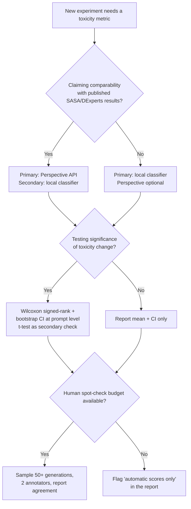

# Methods: Done, Intended, and Undecided

This document records the project's methodological state: what is implemented and tested, what is planned (and why, plus how each plan could fail), and which design choices remain open with the rule we will use to resolve them. It complements `docs/ARCHITECTURE.md` (code design) and `docs/ROADMAP.md` (phasing).

## Done

### Subspace learner
`SubspaceLearner` (`sasa/subspace_learner.py`) fits class-conditional Gaussian parameters for toxic and non-toxic embeddings and derives the optimal linear Bayes classifier in closed form — a weight vector `w` and bias `b` defining a separating hyperplane, following Ko et al. 2024 (arXiv:2410.03818). It exposes `fit`, `classify`, `compute_margin` (signed distance to the boundary), and `save`/`load` for reuse across sessions. Embeddings are produced by `extract_embeddings_from_model` (last-token hidden states).

### Margin-based sampler
`SASASampler` (`sasa/sampler.py`) implements the core update `logits_adjusted = logits + alpha * margins`: per-token margins are computed by approximating the next context embedding from the current hidden state and each candidate token's embedding (`compute_token_margins`), then combined with the model's logits with strength `alpha`. Temperature, top-k, and nucleus (top-p) sampling are supported. The update is the closed-form solution of the paper's alignment-vs-utility constrained optimization.

### Baselines
`BaselineSampler` (`sasa/sampler.py`) reproduces standard autoregressive sampling with identical temperature/top-k/top-p controls and no margin term, enabling apples-to-apples comparisons.

### Tests
15 passing tests in `tests/test_sasa.py` covering initialization, fitting, classification, margin computation, sampling behavior, and save/load round-trips (`pytest tests/test_sasa.py -v`).

### Reported metrics
GPT-2 evaluation: RealToxicityPrompts (Gehman et al. 2020, arXiv:2009.11462) toxicity 0.481 → 0.426; AttaQ 0.264 → 0.142; perplexity comparable to baseline. Framing caveats: single model, single `alpha`, automatic toxicity scoring only. See `docs/INTRODUCTION.md` §5.

## Intended

Each roadmap module below is tracked as an issue in the backlog (see `docs/PROJECT.md`); rationale and its principal failure mode are listed here.

1. **BOLD bias + sycophancy probe evaluation harness.** *Rationale:* toxicity-only evaluation misses other harms; BOLD covers demographic bias and CAA-style contrastive pairs (Rimsky et al. 2023, arXiv:2312.06681) probe sycophancy. *Failure mode:* probes may be too insensitive to detect SASA-level effect sizes, yielding uninformative nulls.
2. **Human spot-check protocol.** *Rationale:* automatic toxicity scores (Perspective API) can be gamed by evasive paraphrase and embed their own biases. *Failure mode:* low inter-annotator agreement making scores unusable; mitigated by a written rubric and majority vote.
3. **Pre-registered full benchmark re-run.** *Rationale:* current numbers are single-configuration; pre-registration prevents metric fishing. *Failure mode:* results may regress relative to the README numbers — we commit to reporting honestly either way.
4. **Llama-family hidden-state adapter.** *Rationale:* SASA is model-agnostic in theory; Llama support makes the repo useful on modern models and unblocks Phase 3. *Failure mode:* toxicity may be less linearly separable in Llama layers, requiring layer search.
5. **Alpha scheduling module (fixed/linear/cosine).** *Rationale:* a constant nudge may be suboptimal — toxicity risk varies across a generation. *Failure mode:* schedules add hyperparameters without measurable gain; the undecided-choice rule below governs.
6. **Latency/overhead benchmark vs `BaselineSampler`.** *Rationale:* SASA's selling point is near-zero cost; this must be measured, not assumed. *Failure mode:* the per-vocab margin computation may prove expensive on large vocabularies, motivating caching.
7. **TSM-MA modules (Phase 3).** Serializable subspace module; Procrustes transfer map; small→large transfer experiment; multi-attribute margin composition; results report. *Rationale and failure modes:* see `docs/ROADMAP.md` Phase 3 and the research gap (cross-model transfer exists for steering vectors — Huang et al. 2025, arXiv:2501.02009; Oozeer et al. 2025, arXiv:2503.04429 — but not for margin-based decoding control, and SASA defers multi-attribute to future work).
8. **Packaging/example/API docs.** `pyproject.toml` cleanup, end-to-end GPT-2 example, `docs/API_REFERENCE.md`. *Rationale:* contribution-readiness. *Failure mode:* trivial.

## Undecided choices

For each open choice we list **both options** and a **selection rule**. A choice is resolved only when the rule is applied and the outcome recorded here.

### U1. Toxicity scoring: Perspective API vs classifier-based

- **Option A — Perspective API** (as used with RealToxicityPrompts, Gehman et al. 2020, arXiv:2009.11462). Pros: the field-standard metric, directly comparable to published SASA/DExperts numbers. Cons: external dependency, rate limits/cost, known demographic biases, gameable by paraphrase.
- **Option B — Local classifier-based scoring** (e.g., a fine-tuned toxicity classifier run offline). Pros: reproducible, free, versionable, no network dependency. Cons: not comparable to published tables; classifier choice becomes its own research decision.
- **Selection rule:** use Perspective API as the *primary* metric whenever comparability to published SASA results is the claim being made; add a local classifier as a *secondary* metric for all new benchmarks (BOLD, AttaQ variants). If API access is unavailable to a contributor, local-only results are acceptable but must be labeled as such. Both metrics are reported side by side in any pre-registered run.

### U2. Alpha: fixed vs scheduled

- **Option A — Fixed alpha.** Pros: matches the paper, one hyperparameter, reproducible. Cons: cannot adapt to varying toxicity risk within a generation.
- **Option B — Scheduled alpha(t)** (linear ramp, cosine decay, or trigger-gated). Pros: can front-load steering or activate only when needed; required for multi-attribute composition. Cons: more hyperparameters, risk of overfitting schedules to benchmarks.
- **Selection rule:** fixed alpha remains the default and the reference configuration. A schedule is adopted only if it beats fixed alpha by a pre-registered margin (toxicity reduction ≥5% relative at matched perplexity, ΔPPL ≤ +1 on WikiText) on a held-out split; otherwise the schedule module ships as an option but is off by default.

### U3. Parametric vs non-parametric comparison tests (for evaluating whether SASA's toxicity reduction is statistically significant)

- **Option A — Parametric tests** (e.g., paired t-test over per-prompt toxicity scores). Pros: familiar, more statistical power *when* assumptions hold, simple confidence intervals. Cons: toxicity scores are bounded, skewed, and often bimodal — normality assumptions are dubious.
- **Option B — Non-parametric tests** (e.g., Wilcoxon signed-rank, bootstrap confidence intervals). Pros: no distributional assumptions, robust to the skewed/bimodal shape of toxicity distributions. Cons: slightly less power; bootstrap CIs require care with the resampling unit (prompt, not token).
- **Selection rule:** default to **non-parametric** (Wilcoxon signed-rank + bootstrap CIs resampled at the prompt level) for all headline comparisons. Add the parametric t-test as a secondary check; if the two disagree, report both and trust the non-parametric result. This rule is fixed in advance to prevent test-shopping.

### U4. Transfer map: orthogonal Procrustes vs ridge regression (Phase 3, TSM-MA)

- **Option A — Orthogonal Procrustes.** Fit an orthogonal (rotation/reflection) map `W` between paired proxy and target hidden states. Pros: closed-form via SVD, parameter-free beyond the map, preserves distances/geometry, matches the alignment approach used in cross-model steering-vector transfer (Huang et al. 2025, arXiv:2501.02009). Cons: the true relationship between architectures may not be orthogonal; weak proxies can violate the assumption badly.
- **Option B — Ridge regression.** Fit an unconstrained linear map with L2 regularization. Pros: strictly more expressive, closed-form, regularization controls overfitting on small paired sets. Cons: can distort geometry (margins may be miscalibrated after transfer); adds a regularization hyperparameter.
- **Selection rule:** fit both on the same paired data; pick by **held-out margin-preservation error** (correlation between transferred margins and directly computed target margins on unseen prompts). Orthogonal Procrustes wins ties (simpler, more interpretable). If ridge wins by >10% relative margin-preservation error, adopt ridge and record the orthogonality failure as a finding.

## Evaluation-selection decision flowchart

## Standing rules

- All empirical claims cite a benchmark, a metric choice resolved per this document, and a test per U3.
- Negative or null results are reported, not deleted.
- No changes to `sasa/` behavior without a corresponding test in `tests/`.
