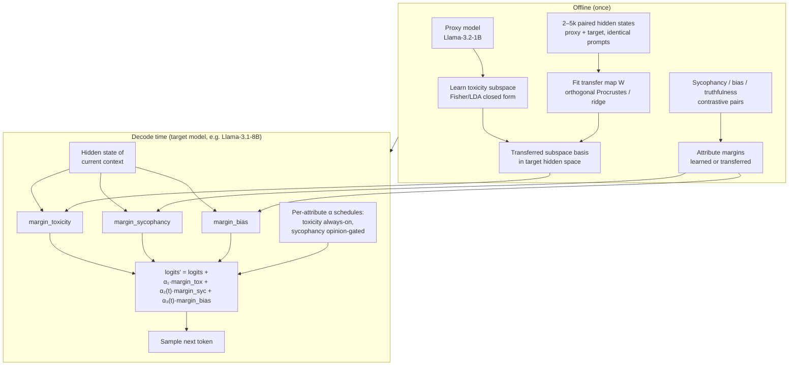

# Roadmap

A phased improvement plan for `llm-self-detoxifier`. Each phase maps to issues in the backlog (`docs/PROJECT.md`). Methodological details and open choices live in `docs/METHODS.md`.

## Phase 0 — Repository hygiene (in progress)

Goal: make the repo contribution-ready without touching the working code.

- [x] Structured docs: `docs/INTRODUCTION.md`, `docs/EXTENDED_INTRODUCTION.md`, `docs/METHODS.md`, `docs/ROADMAP.md`, `docs/PROJECT.md`.
- [x] `CONTRIBUTING.md`, issue template, PR template.
- [ ] `pyproject.toml` packaging cleanup + pytest config.
- [ ] End-to-end example: detoxify GPT-2 on 5 prompts.
- [ ] `docs/API_REFERENCE.md` for `SubspaceLearner` / `SASASampler` / `BaselineSampler`.

Exit criteria: a newcomer can install, run tests, run the example, and pick up an issue without asking questions.

## Phase 1 — Evaluation hardening

Goal: make every number in the README trustworthy and reproducible.

1. **BOLD bias + sycophancy probe harness.** Extend evaluation beyond toxicity: demographic bias (BOLD) and sycophancy probes built from CAA-style contrastive pairs (Rimsky et al. 2023, arXiv:2312.06681).
2. **Human spot-check protocol.** Written rubric, two annotators per sample, inter-annotator agreement reported. Guards against Perspective-API gaming via evasive paraphrase — a known failure mode of automatic toxicity evaluation.
3. **Pre-registered full re-run.** Metrics, alpha values, and significance tests (per `docs/METHODS.md` U1/U3) fixed *before* running; results reported honestly even if they regress.

Exit criteria: a `results/` report with pre-registered metrics, automatic + human scores, and honest negatives.

## Phase 2 — Efficiency + multi-model support

Goal: SASA that runs on modern models with measured overhead.

1. **Llama-family hidden-state adapter** so `SubspaceLearner`/`SASASampler` work on Llama architectures, with tests.
2. **Alpha scheduling module** (fixed / linear / cosine), governed by the selection rule in `docs/METHODS.md` U2.
3. **Latency/overhead benchmark table** vs `BaselineSampler` across model sizes.

Exit criteria: Llama support merged with tests; a published overhead table; alpha scheduling available but on only if it beats the fixed baseline by the pre-registered margin.

## Phase 3 — TSM-MA: Transferred Subspace Margins with Multi-Attribute Scheduling (novel research)

### Gap statement

Cross-model transfer of *steering vectors* now exists: Huang et al. (ACL 2025, arXiv:2501.02009) transfer concept steering vectors between LLMs with learned linear maps, including weak-to-strong; Oozeer et al. (ICML 2025, arXiv:2503.04429) show refusal/backdoor activation-space interventions transfer across Llama, Qwen, and Gemma. The Platonic Representation Hypothesis (Huh et al., ICML 2024, arXiv:2405.07987) gives a theoretical reason such transfer should be possible at all.

But two things are unclaimed:

1. **Transferring margin-based *decoding* control.** All existing transfer work operates in activation space (add vectors to hidden states). Nobody has transferred a toxicity subspace for SASA-style *logit-margin* decoding — learn once on a cheap proxy, transfer the safety subspace, decode on the big model with zero target-side subspace learning.
2. **Composing attribute margins in logit space.** FUDGE composes predictors (Yang & Klein 2021, arXiv:2104.05218); concept algebra composes subspaces in diffusion models (Trager et al. 2023, arXiv:2302.03693). SASA itself explicitly defers multi-attribute composition to future work (Ko et al. 2024, arXiv:2410.03818). Composing toxicity + bias + sycophancy + truthfulness margins, each with its own alpha schedule, is open territory.

TSM-MA claims both: *"learn once on a cheap proxy, transfer the safety subspace across architectures, and compose attribute margins in logit space at decode time."*

### Experiment plan

1. **Same-model baseline.** Reproduce SASA on GPT-2-L and Llama-3.1-8B; expose the subspace (Fisher/LDA closed form) as a serializable module.
2. **Small→large transfer.** Learn the toxicity subspace on Llama-3.2-1B; collect 2–5k paired hidden states (proxy + target on identical prompts); fit an orthogonal Procrustes (+scaling) map `W` (ridge regression as the alternative — see `docs/METHODS.md` U4); transfer the subspace basis; run SASA-margin decoding on the target with zero target-side subspace learning. Compare against direct-learned and naive (identity/PCA) transfer.
3. **Cross-family transfer.** Llama → Qwen/Gemma, using zero-padded PCA to a common dimensionality first.
4. **Multi-attribute composition.** Add sycophancy margins (CAA-style contrastive pairs, arXiv:2312.06681), gender-bias margins (BOLD), and truthfulness margins (TruthfulQA; ITI, arXiv:2306.03341). Decode with `logits + Σ_k alpha_k(t)·margin_k` under per-attribute schedules (toxicity always-on; sycophancy gated on detected user opinion). Study interference: margin orthogonality, sequential vs simultaneous composition.
5. **Ablations and costs.** Alignment data size 100–10k; layer choice; map type (orthogonal vs ridge); latency vs SASA and vs DExperts (arXiv:2105.03023).

### Failure modes (anticipated honestly)

- The toxic subspace may be more architecture-specific than refusal vectors, so transfer could simply fail — a negative result that narrows the project scope.
- Miscalibrated transferred margins → weak detoxification or fluency collapse.
- Conflicting attribute pushes → incoherent text or degenerate loops; the interference study in step 4 exists precisely to measure this.
- The Procrustes orthogonality assumption may fail on weak proxies (resolved per `docs/METHODS.md` U4).
- Perspective-API gaming via evasive paraphrase → human spot-checks (Phase 1) are a prerequisite for trusting Phase 3 numbers.

### Success criteria (pre-registered)

- Transfer within **≤15% relative gap** of direct SASA on RealToxicityPrompts expected-max-toxicity / toxicity-probability, at matched perplexity (ΔPPL ≤ +1 WikiText).
- **≥2 attributes simultaneously improved** with ≤10% fluency cost vs single-attribute SASA.
- Target-side setup cost **<5%** of direct subspace-learning compute.
- All comparisons with the non-parametric tests fixed in `docs/METHODS.md` U3; negative results reported.

### TSM-MA architecture

## Cross-phase rules

- Tests pass before merge; new behavior ships with tests.
- Honest negatives: a failed experiment is documented, not hidden.
- Metrics are pre-registered before full runs (`docs/METHODS.md`).
