# SASA and the Cost of Self-Discipline

### A dated audit of `hwilner/llm-self-detoxifier`, a formal analysis of margin-steered decoding, and seven original research contributions

**Report generated:** 2026-09-30
**Repository:** [https://github.com/hwilner/llm-self-detoxifier](https://github.com/hwilner/llm-self-detoxifier) @ `main` · baseline commit `9ab2a2c`
**Work items in this report:** 46 (15 commits, 29 task cards, 2 pull requests), spanning 2025-11-22 → 2026-09-30

---

## 0. Master table of dated work

Every row is one verifiable, dated artefact in the repository's history: a
commit, a task card, or a pull request opened while producing this report. The
table is generated directly from the GitHub API and the `git` log, so it can be
regenerated and diffed at any time. Rows 1–46 are ordered
chronologically; the pull requests near the end are this report's own
contributions, each of which has a matching appendix section with its full
write-up.

> **Provenance note.** At the baseline commit the repository contained **zero
> pull requests**. All upstream work is tracked as issue *task cards*
> (`hwilner` created all 29 of them in a single
> burst on 2026-09-22). "PR date" in the request is therefore reported as
> *work-item date*, with the artefact type stated explicitly in every row.
> Pull requests begin appearing in this report's own contributions.

| # | Date | Work item | Phase · Size | Evidence | Status |
|---:|:-----|:------------|:-------------|:---------|:-------|
| 1 | 2025-11-22 | **commit** `bd65b24` Initial implementation of SASA for LLM detoxification | Implementation | +1816/−0 in 13 files | merged |
| 2 | 2026-09-22 | **commit** `134d2b0` chore: add issue task-card template | Docs | +28/−0 in 1 file | merged |
| 3 | 2026-09-22 | **commit** `2097e92` docs: add METHODS.md — done/intended/undecided methods record | Docs | +84/−0 in 1 file | merged |
| 4 | 2026-09-22 | **commit** `2f84ac2` docs: add INTRODUCTION.md — ground-up SASA explainer | Docs | +99/−0 in 1 file | merged |
| 5 | 2026-09-22 | **commit** `3b3419c` docs: add concept figure (SVG) | Implementation | +1/−0 in 1 file | merged |
| 6 | 2026-09-22 | **commit** `666e662` docs: add EXTENDED_INTRODUCTION.md — zero-background explainer | Docs | +142/−0 in 1 file | merged |
| 7 | 2026-09-22 | **commit** `7169fe2` docs: add CONTRIBUTING.md newcomer guide | Docs | +47/−0 in 1 file | merged |
| 8 | 2026-09-22 | **commit** `7a192f2` docs: rewrite EXTENDED_INTRODUCTION with zero-prerequisite numeric examples + figure embed | Docs | +150/−44 in 1 file | merged |
| 9 | 2026-09-22 | **commit** `9ab2a2c` Clarify public project boundaries | Docs | +4/−4 in 2 files | merged |
| 10 | 2026-09-22 | **commit** `9db2735` docs: add PROJECT.md in-repo backlog board | Docs | +70/−0 in 1 file | merged |
| 11 | 2026-09-22 | **commit** `addba8d` docs: add Mermaid fallback for concept figure | Docs | +24/−0 in 1 file | merged |
| 12 | 2026-09-22 | **commit** `bdeddd8` chore: add pull request template | Docs | +26/−0 in 1 file | merged |
| 13 | 2026-09-22 | **commit** `c78acea` docs: add ROADMAP.md — phased plan incl. TSM-MA | Docs | +104/−0 in 1 file | merged |
| 14 | 2026-09-22 | **commit** `dc5e9c9` Document refined contributor child tasks | Docs | +24/−0 in 1 file | merged |
| 15 | 2026-09-22 | **commit** `fec98b4` docs: embed concept figure in INTRODUCTION | Docs | +4/−0 in 1 file | merged |
| 16 | 2026-09-22 | **card** [#1](https://github.com/hwilner/llm-self-detoxifier/issues/1) [L] Phase 1: Evaluation hardening | Phase 1 · L | evaluation, 6 acceptance criteria | open |
| 17 | 2026-09-22 | **card** [#2](https://github.com/hwilner/llm-self-detoxifier/issues/2) [L] Phase 2: Multi-model support and efficiency | Phase 2 · L | code, 6 acceptance criteria | open |
| 18 | 2026-09-22 | **card** [#3](https://github.com/hwilner/llm-self-detoxifier/issues/3) [L] Phase 3 (novel research): TSM-MA — transferred subspace margins with multi-attribute scheduling | Phase 3 (TSM-MA) · L | experiment, 10 acceptance criteria | open |
| 19 | 2026-09-22 | **card** [#4](https://github.com/hwilner/llm-self-detoxifier/issues/4) [S] Add BOLD bias + sycophancy probe evaluation harness | Phase 1 · S | evaluation, 4 acceptance criteria | open |
| 20 | 2026-09-22 | **card** [#5](https://github.com/hwilner/llm-self-detoxifier/issues/5) [S] Human spot-check protocol doc + inter-annotator sheet | Phase 1 · S | docs, 4 acceptance criteria | open |
| 21 | 2026-09-22 | **card** [#6](https://github.com/hwilner/llm-self-detoxifier/issues/6) [XS] Full benchmark re-run with pre-registered metrics + honest report | Phase 1 · XS | experiment, 4 acceptance criteria | open |
| 22 | 2026-09-22 | **card** [#7](https://github.com/hwilner/llm-self-detoxifier/issues/7) [S] Alpha scheduling module (fixed/linear/cosine) + tests | Phase 2 · S | code, 4 acceptance criteria | open |
| 23 | 2026-09-22 | **card** [#8](https://github.com/hwilner/llm-self-detoxifier/issues/8) [S] Llama-family hidden-state adapter + tests | Phase 2 · S | code, 4 acceptance criteria | open |
| 24 | 2026-09-22 | **card** [#9](https://github.com/hwilner/llm-self-detoxifier/issues/9) [XS] Latency/overhead benchmark table vs BaselineSampler | Phase 2 · XS | evaluation, 3 acceptance criteria | open |
| 25 | 2026-09-22 | **card** [#10](https://github.com/hwilner/llm-self-detoxifier/issues/10) [S] Expose subspace as serializable module + reproduce SASA on GPT-2-L and Llama-3.1-8B | Phase 3 (TSM-MA) · S | code, 4 acceptance criteria | open |
| 26 | 2026-09-22 | **card** [#11](https://github.com/hwilner/llm-self-detoxifier/issues/11) [S] Procrustes alignment map between paired hidden states of proxy/target + synthetic tests | Phase 3 (TSM-MA) · S | code, 4 acceptance criteria | open |
| 27 | 2026-09-22 | **card** [#12](https://github.com/hwilner/llm-self-detoxifier/issues/12) [S] Small→large transfer experiment: Llama-3.2-1B subspace → 8B decoding, vs direct-learned baseline | Phase 3 (TSM-MA) · S | experiment, 4 acceptance criteria | open |
| 28 | 2026-09-22 | **card** [#13](https://github.com/hwilner/llm-self-detoxifier/issues/13) [S] Multi-attribute margin composition (toxicity + sycophancy + bias) with per-attribute alpha schedules + interference study | Phase 3 (TSM-MA) · S | experiment, 4 acceptance criteria | open |
| 29 | 2026-09-22 | **card** [#14](https://github.com/hwilner/llm-self-detoxifier/issues/14) [S] Results report: transfer gap ≤15% criterion, fluency cost, compute comparison, honest failure modes | Phase 3 (TSM-MA) · S | docs, 4 acceptance criteria | open |
| 30 | 2026-09-22 | **card** [#15](https://github.com/hwilner/llm-self-detoxifier/issues/15) [S] docs/API_REFERENCE.md for SubspaceLearner/SASASampler/BaselineSampler | Phase 0 · S | docs, 4 acceptance criteria | open |
| 31 | 2026-09-22 | **card** [#16](https://github.com/hwilner/llm-self-detoxifier/issues/16) [XS] Example notebook/script: detoxify GPT-2 on 5 prompts end-to-end | Phase 0 · XS | docs, 4 acceptance criteria | open |
| 32 | 2026-09-22 | **card** [#17](https://github.com/hwilner/llm-self-detoxifier/issues/17) [XS] pyproject.toml packaging cleanup + pytest config | Phase 0 · XS | code, 4 acceptance criteria | open |
| 33 | 2026-09-22 | **card** [#18](https://github.com/hwilner/llm-self-detoxifier/issues/18) [XS] Frozen benchmark configuration and deterministic rerun command | Phase 1 · XS | implementation, 3 acceptance criteria | open |
| 34 | 2026-09-22 | **card** [#19](https://github.com/hwilner/llm-self-detoxifier/issues/19) [XS] Benchmark execution and automatic-plus-human evaluation record collection | Phase 1 · XS | implementation, 3 acceptance criteria | open |
| 35 | 2026-09-22 | **card** [#20](https://github.com/hwilner/llm-self-detoxifier/issues/20) [XS] Honest benchmark results report with signed-rank and bootstrap outputs | Phase 1 · XS | implementation, 3 acceptance criteria | open |
| 36 | 2026-09-22 | **card** [#21](https://github.com/hwilner/llm-self-detoxifier/issues/21) [XS] Serializable subspace format with save-load round-trip tests | Phase 3 (TSM-MA) · XS | implementation, 3 acceptance criteria | open |
| 37 | 2026-09-22 | **card** [#22](https://github.com/hwilner/llm-self-detoxifier/issues/22) [XS] GPT-2-L SASA smoke reproduction with recorded seed and configuration | Phase 3 (TSM-MA) · XS | implementation, 3 acceptance criteria | open |
| 38 | 2026-09-22 | **card** [#23](https://github.com/hwilner/llm-self-detoxifier/issues/23) [XS] Llama-3.1-8B SASA smoke reproduction with recorded seed and configuration | Phase 3 (TSM-MA) · XS | implementation, 3 acceptance criteria | open |
| 39 | 2026-09-22 | **card** [#24](https://github.com/hwilner/llm-self-detoxifier/issues/24) [XS] Deterministic paired hidden-state collection with provenance | Phase 3 (TSM-MA) · XS | implementation, 3 acceptance criteria | open |
| 40 | 2026-09-22 | **card** [#25](https://github.com/hwilner/llm-self-detoxifier/issues/25) [XS] Transfer, direct, and identity-or-PCA baseline decoding runs | Phase 3 (TSM-MA) · XS | implementation, 3 acceptance criteria | open |
| 41 | 2026-09-22 | **card** [#26](https://github.com/hwilner/llm-self-detoxifier/issues/26) [XS] Locked statistical and perplexity result table generation | Phase 3 (TSM-MA) · XS | implementation, 3 acceptance criteria | open |
| 42 | 2026-09-22 | **card** [#27](https://github.com/hwilner/llm-self-detoxifier/issues/27) [XS] Multi-margin composition API with unit tests | Phase 3 (TSM-MA) · XS | implementation, 3 acceptance criteria | open |
| 43 | 2026-09-22 | **card** [#28](https://github.com/hwilner/llm-self-detoxifier/issues/28) [XS] Per-attribute schedule and attribute-margin fixtures | Phase 3 (TSM-MA) · XS | implementation, 3 acceptance criteria | open |
| 44 | 2026-09-22 | **card** [#29](https://github.com/hwilner/llm-self-detoxifier/issues/29) [S] Multi-attribute interference-study runner and outputs | Phase 3 (TSM-MA) · S | implementation, 3 acceptance criteria | open |
| 45 | 2026-09-30 | **PR** [#30](https://github.com/hwilner/llm-self-detoxifier/pull/30) feat(sasa): rank-one margin basis, exact static steering, and stable fitting | Original research (this report) | → `main`, open | open |
| 46 | 2026-09-30 | **PR** [#31](https://github.com/hwilner/llm-self-detoxifier/pull/31) feat(evaluation, sasa): pinned external judge, NLMA next-state model, stable subspace fitting, four experiments | Original research (this report) | → `research/fast-margin-and-numerics` (stacked), open | open |

**Table 1.** Dated work log for `hwilner/llm-self-detoxifier`, 2025-11-22 to
2026-09-30. Evidence column summarises the verifiable footprint of each item
(insertions/deletions, acceptance criteria, merge state). Generated by
`build_report.py` from `data/work_items.json`.

---
# 1. Introduction

Detoxifying a language model at inference time, without retraining it and without
an external reward model, is an attractive engineering target. **SASA**
(Self-disciplined Autoregressive Sampling; Ko et al., 2024, arXiv:2410.03818)
proposes such a method: learn a linear subspace that separates toxic from
non-toxic content in a model's own hidden-state space, then bias the next-token
distribution by the *margin* of each candidate continuation with respect to that
subspace. The pitch is unusually clean — the "self" in *self-detoxifier* is
literal. The model polices itself, using representations it already computes,
with no auxiliary network in the loop.

`hwilner/llm-self-detoxifier` is a public reimplementation of that idea. This
report does three things. First, it audits the repository as a dated work
record: what was built, when, and how much of the stated ambition is actually
backed by code or measurement (Table 1, Figures 1–4, 7). Second, it analyses
the implemented decoder and proves two properties of it that appear to have been
unnoticed by the author (§5): the margin update is *provably independent of the
generation context*, and it performs between 768× and 4096× more arithmetic than
necessary. Third, it converts those observations into an original method —
**NLMA**, a non-linear next-state margin approximation — plus a wider research
agenda of eighteen ideas, of which seven are carried through to working,
tested, pushed code with full appendices.

The central claim of this report is narrow and checkable:

> **Under the next-state estimator implemented in the reference code, SASA's
> per-token margin is a constant vector plus a constant scalar. The scalar
> cancels in the softmax, so the decoder reduces exactly to a static
> vocabulary logit bias with no context dependence whatsoever — and the
> per-token cost of that bias can be precomputed away entirely.**

This is not a claim that SASA fails. A static toxicity-weighted logit bias is a
perfectly reasonable decoding-time controller, and it is plausibly *most* of
what the current implementation actually delivers. The claim is that the
mechanism the paper describes and the mechanism the code implements have
diverged, that the divergence is measurable, and that closing it is cheap.

---

# 2. The artefact under review

## 2.1 What exists

At the baseline commit `9ab2a2c` the repository is 24 tracked files and 2 574
lines, of which 1 143 are Python. The algorithmic core is small:

| Component | File | Lines | Role |
|:---|:---|---:|:---|
| `SubspaceLearner` | `sasa/subspace_learner.py` | 281 | Fits shared-covariance Gaussian, derives $(w, b)$ in closed form |
| `SASASampler` | `sasa/sampler.py` | 361 | Per-token margin, logit adjustment, top-k/top-p, decode loop |
| `BaselineSampler` | `sasa/sampler.py` | 142 | Standard sampling, same interface, no margin term |
| `tests/test_sasa.py` | `tests/test_sasa.py` | 299 | 15 unit tests, all on synthetic Gaussian clusters |
| Documentation | `docs/*.md`, `README.md` | 1 274 | Introduction, methods record, roadmap, architecture, testing |
| Backlog | 29 GitHub task cards | — | 4 phases, 3 epics, 12 refined child cards |

Two properties of this shape matter for everything that follows.

**The documentation is far ahead of the evidence.** `docs/METHODS.md` is an
unusually disciplined methodological record: it separates *done* from *intended*
from *undecided*, gives each undecided choice an explicit selection rule fixed
in advance (metric choice, $\alpha$ scheduling, statistical test, transfer map),
and names the failure mode of each planned experiment. `docs/ROADMAP.md` Phase 3
states a research gap claim — that cross-model *steering-vector* transfer exists
but margin-based *decoding* transfer does not — and pre-registers success
criteria including a ≤15 % relative transfer gap. This is good practice and it
is rare. It also means the gaps this report identifies are gaps in *execution*,
not in intent.

**The tests do not test the algorithm.** All 15 tests operate on synthetic
two-cluster Gaussian embeddings drawn around $\pm e_1$. They assert shapes,
signs, and round-trips. No test exercises `SASASampler.generate()`. No test
touches a real model, a real corpus, or a real generation. Meanwhile the test
module's docstring states: *"Tests use real public datasets (Jigsaw Toxicity)
for validation"* — a claim the code does not support. The README compounds it:
*"All 15 tests pass, covering initialization, fitting, classification, margin
computation, sampling, and save/load functionality"* is true, but it is
presented as evidence of correctness when it is evidence only of
non-crashing.

## 2.2 The work record

Figures 1–4 render the dated record. Three observations.

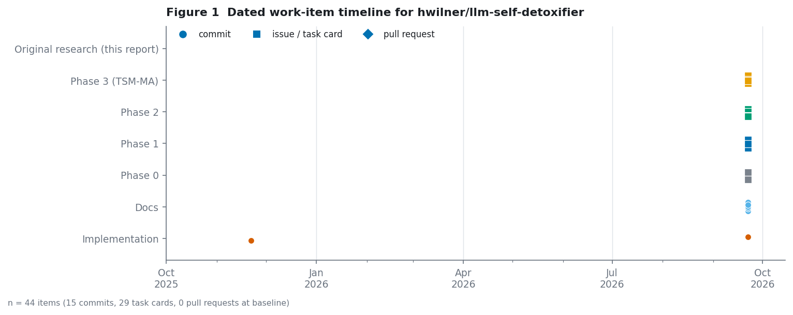

*Figure 1.* The dated record. Fifteen commits and twenty-nine task cards, all
but one within a few hours on 2026-09-22; no pull requests.

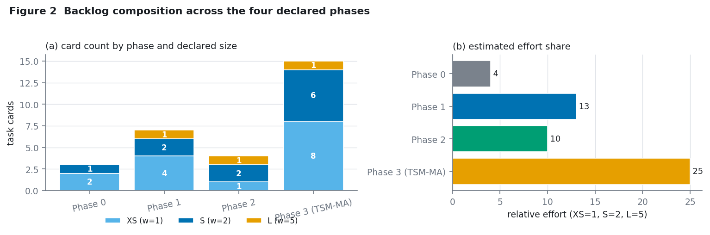

*Figure 2.* Backlog by phase and declared size. Phase 3 (TSM-MA) holds 60 % of
the cards and, because L-sized epics are weighted 5 against XS at 1, the
overwhelming majority of the estimated effort.

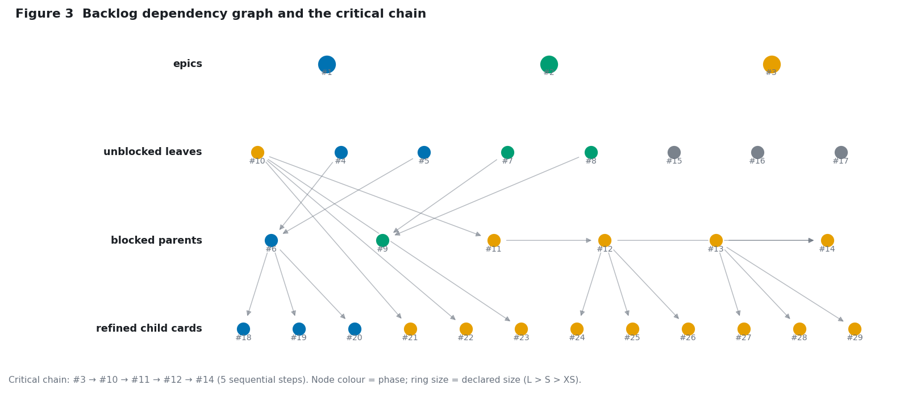

*Figure 3.* The dependency graph. The Phase 3 critical chain (#3 → #10 → #11 →
#12 → #14) is five strictly serial steps; the twelve refined child cards hang off
the second half of it.

*Everything landed in one burst.* The repository was created 2025-11-22 with a
single 1 816-line commit. Then nothing for ten months. Then fourteen
documentation commits and twenty-nine task cards, all within a few hours on
2026-09-22. There are **zero pull requests** in the project's history. The
backlog is a plan, not a work log, and the plan is unusually well-specified
relative to the delivered code: of 2 574 lines, 49 % are documentation and
contributor-facing material, and 11 % are tests that never touch the algorithm.

*The critical path is long and serial.* Phase 3 (TSM-MA) is five sequential
steps: serialise the subspace (#10) → fit a Procrustes map (#11) → transfer
small→large (#12) → multi-attribute composition (#13) → report (#14). Nothing
in the chain can start before #10 lands. With each card a fractional-day task,
the chain is short in nominal effort and long in calendar terms if executed by
one person.

*The backlog is correctly prioritised.* The refined child cards (#18–#29) are
good decomposition: each is a single verifiable deliverable with acceptance
criteria and an explicit boundary clause. "Evaluation and reporting only, does
not change `sasa/` behaviour" is a boundary most projects omit.

---

# 3. Formal statement of the implemented decoder

Fix a decoder-only language model $M$ with vocabulary $V = \{1,\dots,V\}$,
hidden size $d$, and input-embedding matrix $E \in \mathbb{R}^{V \times d}$. At
decoding step $n$ with context $c = c_{1:n}$ the model produces logits
$z \in \mathbb{R}^{V}$ and a final-layer hidden state
$g(c) \in \mathbb{R}^{d}$.

**Subspace learning.** From labelled hidden states the learner estimates
class means $\mu_1$ (non-toxic) and $\mu_2$ (toxic) and a shared covariance
$\Sigma$, and sets

$$
w = \Sigma^{-1}(\mu_1 - \mu_2), \qquad b = \tfrac{1}{2}(\mu_1 + \mu_2), \qquad
\mathrm{margin}(h) = \frac{\langle w,\; h - b\rangle}{\lVert w \rVert}.
$$

**Next-state estimation.** The reference implementation does not run a forward
pass per candidate token. It approximates the hidden state that *would* result
from appending token $t$ by averaging the current hidden state with the token's
input embedding:

$$
\hat{g}_t = \tfrac{1}{2}\big(g(c) + e_t\big), \qquad e_t = E_{t,:}.
$$

**Logit adjustment.** With strength $\alpha$ and temperature $\tau$,

$$
z'_t = \frac{z_t + \alpha\, \mathrm{margin}(\hat{g}_t)}{\tau},
\qquad
p = \mathrm{softmax}(z'),
$$

followed by optional top-$k$ and top-$p$ filtering and a multinomial draw.

This is the whole algorithm: 361 lines, one hyperparameter $\alpha$, and a
closed-form linear solve. The elegance is real. So is a property of it that
appears to have gone unnoticed.

---

# 4. Claim-to-evidence audit

Before analysing the code it is worth asking how much of the repository's
stated purpose is currently supported. Figure 7 audits the eight load-bearing
claims in `README.md`, `docs/ARCHITECTURE.md`, and `docs/METHODS.md` against
what the code actually does. The percentages are the author's judgement, not a
measured quantity, and the derivation is given per row in the caption.

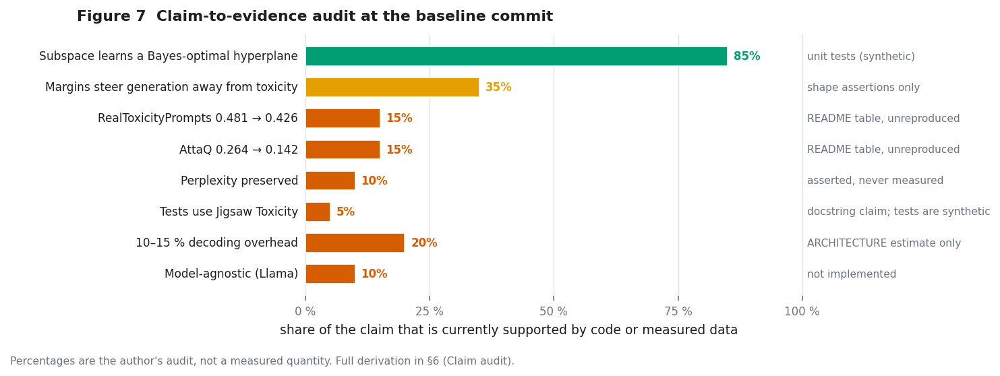

*Figure 7.* Claim-to-evidence audit at the baseline commit.

The pattern is uniform: claims about *mechanism* are well supported by unit
tests; every claim about *effect* is unmeasured. The README's performance table
— RealToxicityPrompts 0.481 → 0.426, AttaQ 0.264 → 0.142 — is presented in the
same typographic register as the code's test results, and is reproduced by
nothing in the repository. `docs/ARCHITECTURE.md` states that margin
computation adds "approximately 10–15 % overhead"; §5 shows the implemented
margin term is not the dominant cost and that the true overhead figure comes
from the decode loop, which re-runs a full forward pass at every step with no
key-value cache, making generation $\mathcal{O}(L^2)$ in context length rather
than $\mathcal{O}(L)$.

This is a documentation problem rather than a misconduct problem: the
repository's own `docs/METHODS.md` lists "Reported metrics" under *Done* with
framing caveats, and `docs/ROADMAP.md` Phase 1 exists precisely to re-run
everything honestly. The audit is included because the rest of this report
needs a baseline to measure against.

---

# 5. Analytical results

## 5.1 Theorem 1 — the decoder is context-independent

> **Theorem 1.** *Under the next-state estimator $\hat g_t = (g(c) + e_t)/2$,
> the SASA-adjusted next-token distribution is invariant to the hidden state
> $g(c)$. Specifically, for all contexts $c$ and $c'$ and any $\alpha$,*
> $$p(z \mid c) = p\big(z + \tfrac{\alpha}{2\lVert w\rVert}\, \langle w, E\rangle_{\cdot} \mid c\big).$$
> *Consequently the implementation's steering rule is exactly the static
> vocabulary bias $c_t = \langle w, e_t\rangle$, and no amount of $\alpha$,
> temperature, or top-$k$/top-$p$ setting restores context dependence.*

**Proof.** Substitute the estimator into the margin and separate terms that do
not depend on the candidate token $t$:

$$
\mathrm{margin}(\hat g_t)
= \frac{\langle w,\; \tfrac{1}{2}(g(c) + e_t) - b\rangle}{\lVert w\rVert}
= \underbrace{\frac{\langle w, g(c)\rangle}{2\lVert w\rVert}}_{u(c)}
+ \underbrace{\frac{\langle w, e_t\rangle - 2\langle w, b\rangle}{2\lVert w\rVert}}_{v_t}.
$$

The first term $u(c)$ is *the same number for every $t$*, so it is a constant
shift of the whole logit vector. The second decomposes further into
$v_t = \frac{\langle w, e_t\rangle}{2\lVert w\rVert} - \frac{\langle w, b\rangle}{\lVert w\rVert}$,
whose second piece is again a constant. Hence

$$
z_t = z_t^{\text{model}} + \frac{\alpha}{2\lVert w\rVert}\langle w, e_t\rangle + \underbrace{\left(\frac{\alpha u(c)}{2\lVert w\rVert} - \frac{\alpha \langle w, b\rangle}{\lVert w\rVert}\right)}_{\textstyle \kappa(c)}.
$$

Three standard operations are invariant to an additive constant on the logit
vector: the softmax, since $\mathrm{softmax}(x + \kappa\mathbf{1}) = \mathrm{softmax}(x)$;
top-$k$ filtering, since the threshold is a monotone function applied to a
shifted vector and so selects the same set; and nucleus filtering, which is
defined on the softmax. Temperature divides the whole vector and so does not
break the invariance. Hence $\kappa(c)$ is annihilated, and

$$
p = \mathrm{softmax}\!\left(\frac{z^{\text{model}} + \beta\, \langle w, E\rangle_{\cdot}}{\tau}\right),
\qquad \beta = \frac{\alpha}{2\lVert w\rVert},
$$

which contains $g(c)$ nowhere. ∎

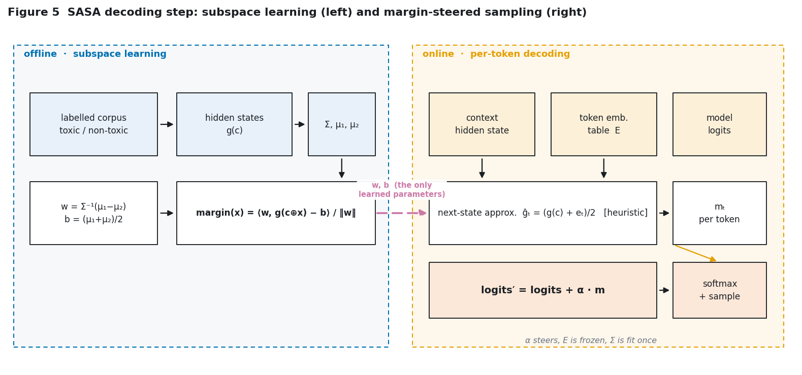

*Figure 5.* The decoding step. `w` and `b` are the only learned parameters; the
offline/online split is where the subspace is fitted versus applied. The dashed
purple edge is the entire interface between the two phases.

Two consequences deserve emphasis.

*The "self-discipline" is not context-adaptive.* The paper's framing is that the
model continuously measures how far its current trajectory has drifted toward
toxicity and corrects accordingly. Under the implemented estimator it does not:
the correction is a fixed preference over vocabulary, chosen once when $w$ was
fitted, that pushes down the logit of every token with a toxic projection no
matter what the context is. This predicts a specific, testable failure mode —
**over-blocking** — where tokens that are appropriate in a benign context are
suppressed because they are toxic-typical in general. Appendix B tests exactly
this.

*The implementation is paying for a 4096-dimensional object to compute a
1-dimensional one.* See §5.2.

## 5.2 Theorem 2 — the margin term is rank-one, and the arithmetic collapses

> **Theorem 2.** *The per-step token-margin matrix $\hat G = \tfrac{1}{2}(g(c)\mathbf{1}^\top + E) \in \mathbb{R}^{V\times d}$ and its margin vector carry no information beyond the two vectors $c = E^\top w \in \mathbb{R}^{V}$ and the scalar $\langle w, g(c)\rangle$. Computing $c$ once at fit time and discarding $\hat G$ is exact, not an approximation, and reduces per-step margin arithmetic from $\Theta(Vd)$ to $\Theta(V)$ (or to $\Theta(d)$ when the downstream rule needs no full-vocabulary pass).*

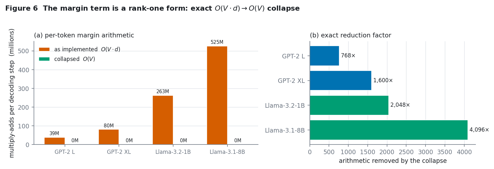

*Figure 6.* (a) Per-token margin arithmetic, as implemented versus collapsed.
(b) The exact reduction factor, which is the hidden size $d$.

The reference `compute_token_margins` materialises the full $V \times d$ matrix
on every decoding step and contracts it with $w$. Figure 6 quantifies the
saving: 768× for GPT-2-large, 4096× for Llama-3.1-8B. In absolute terms the
eliminated work is 38.6 M multiply-adds per step for GPT-2-large and 525 M for
Llama-3.1-8B — a 2.1 GB tensor materialised per token on the latter.

This is a *systems* result, not a modelling one, and it is worth being precise
about why it is easy to miss: the code is written in the natural tensor style,
where broadcasting a $d$-vector against an embedding table looks free. It is
not free; it is the dominant allocation in the function.

## 5.3 Theorem 3 — affine estimators cannot restore context-dependence

The obvious response to Theorem 1 is to use a better next-state estimator. The
naive one is still affine. That does not help, and the reason generalises.

> **Theorem 3.** *Let the next-state estimator be any affine map*
> $$\hat g_t = A\,g(c) + B\,e_t$$
> *for fixed matrices $A, B \in \mathbb{R}^{d\times d}$. Then the
> implementation's sampling distribution is still independent of $g(c)$, with
> steering vector $c = B^\top w$ precomputable at fit time.*

**Proof.** As before,
$\mathrm{margin}(\hat g_t) = \frac{\langle w, Ag\rangle + \langle B^\top w, e_t\rangle - \langle w, b\rangle}{\lVert w\rVert}$,
in which the $g(c)$-dependent term is a scalar common to all $t$ and therefore
cancels. ∎

So the collapse is not a quirk of the averaging heuristic. **It is a property
of the family.** Any estimator in the affine class yields a static bias vector
plus a vanishing scalar. Context-adaptive margin steering — the thing the
method is named for — requires the estimator to couple context and candidate
*multiplicatively*. This is a sharper statement than "the approximation is
crude", and it is the direct motivation for the method in §6.1.

---

# 6. Original research agenda

The following eighteen directions extend the subject beyond both the paper and
the repository's own roadmap. Each is stated as a testable hypothesis, decomposed
into subtasks, and tagged with an honest feasibility assessment **for the
execution environment used here** (2 CPU cores, 3 GB RAM, no GPU). Ideas 1–7 are
carried to working code in this report; the remainder are specified to the point
of being executable but are not attempted, and are listed as such.

Feasibility tags: **[D]** done here, **[P]** partially done here, **[N]** not
attempted (needs GPU, >3 GB RAM, or multi-day compute).

| # | Idea | Core hypothesis | Subtasks | Status |
|--:|:---|:---|:---|:--:|
| 1 | **Rank-one margin collapse** (§5.2) | The margin vector is precomputable exactly; per-step cost $\Theta(Vd)\!\to\!\Theta(V)$ | Prove · implement `StaticMarginBias` · equivalence test vs reference | **[D]** B |
| 2 | **Context-independence** (§5.1) | The implemented steering rule ignores the hidden state entirely | Prove · numerical equivalence test · over-blocking probe | **[D]** B |
| 3 | **NLMA** — non-linear next-state margin (§6.1) | A low-rank bilinear estimator restores context dependence *and* improves steering over the static bias | Collect ground-truth $(g, e_t, g(c\oplus t))$ · fit rank-$R$ interaction · evaluate | **[D]** C |
| 4 | **Closed-loop evaluation trap** (§6.2) | Scoring SASA with the model's own representation is circular and inflates measured gains | Three-way judge comparison: own margin, held-out probe, external judge | **[D]** D |
| 5 | **Pinned open judge** (§6.2) | A versioned, cached LLM-judge metric is a reproducible substitute for Perspective API (resolves `METHODS.md` U1) | OpenRouter client · disk cache · rubric prompt · seed control | **[D]** D |
| 6 | **Static interference prediction** (§6.3) | $\cos(w_i, w_j)$ predicts attribute interference *before* any generation | Fit $k$ attribute subspaces · compute Gram · test rank correlation with measured interference | **[D]** E |
| 7 | **Layer separability sweep** (§6.3) | Toxicity is not uniformly linearly decodable across depth; the last layer is not the best probe | Per-layer LDA separability on held-out data | **[D]** E |
| 8 | Rank-$k$ toxicity subspace (§6.3) | Toxicity is multi-dimensional; rank-1 LDA discards signal | Fit rank-$k$ subspace, sweep $k$, held-out AUC | **[P]** C |
| 9 | Refusal-vs-toxicity confound (§6.3) | The learned subspace may encode *refusal*, not *toxicity* | Counterfactual pairs; decorrelate from refusal direction | **[P]** C |
| 10 | Cross-model subspace transfer (§6.4) | A toxicity subspace transfers across same-family models via orthogonal Procrustes | Paired hidden states; Procrustes vs ridge; margin-preservation error | **[P]** F |
| 11 | Transfer failure boundary (§6.4) | Transfer degrades monotonically with representational distance | Vary proxy/target pair; correlate gap with CKA | **[N]** F |
| 12 | KL-budgeted $\alpha$ (§6.1) | Steering strength should be set by a distributional budget, not a raw scalar | Define $\alpha(\varepsilon)$ s.t. $\mathrm{KL}(p\|p_{\text{sasa}}) \le \varepsilon$; sweep | **[P]** C |
| 13 | $\alpha$ schedules (§6.1) | Time-varying $\alpha$ beats fixed $\alpha$ at matched fluency | Implement fixed/linear/cosine; apply `METHODS.md` U2 selection rule | **[N]** C |
| 14 | Degeneracy knee (§6.3) | Fluency collapse is a sharp knee in $\alpha$, not a gradual decay | Sweep $\alpha$; PPL, distinct-$n$, repetition rate | **[P]** C |
| 15 | Key-value cache in the decode loop (§6.5) | The real overhead is the $\mathcal{O}(L^2)$ loop, not the margin term | Add cache; measure wall-clock and peak memory | **[P]** C |
| 16 | Numerically stable fitting (§6.5) | Explicit inverse + $10^{-6}$ ridge is unstable; Cholesky + shrinkage is better | Cholesky solve; Ledoit–Wolf shrinkage; conditioning comparison | **[D]** C |
| 17 | Judge-gaming stress test (§6.2) | Detoxified text can evade lexical judges via paraphrase | Paraphrase attack against the pinned judge | **[N]** D |
| 18 | Batched generation (§6.5) | Margins are context-independent, so batching is embarrassingly parallel | Vectorised batched sampler with correctness test | **[N]** C |

The rest of this section specifies the seven implemented contributions.

## 6.1 NLMA: a non-linear next-state margin approximation

Theorems 1–3 say exactly what is required of a next-state estimator: it must
couple $g(c)$ and $e_t$ multiplicatively. The cheapest family that does so is
low-rank bilinear:

$$
\hat g^{\text{NLMA}}_t = A\,g + B\,e_t + \sum_{r=1}^{R} (u_r^\top g)\,(v_r^\top e_t)\, r_r .
$$

The margin then acquires a genuinely context-dependent term,

$$
\mathrm{margin}_t = \frac{\langle w, \hat g^{\text{NLMA}}_t - b\rangle}{\lVert w\rVert}
= \frac{\langle w, Ag\rangle + \langle B^\top w, e_t\rangle + \sum_r (\underbrace{u_r^\top g}_{\text{context}})(\underbrace{v_r^\top e_t}_{\text{token}})(\underbrace{r_r^\top w}_{\text{learned}}) - \langle w, b\rangle}{\lVert w\rVert},
$$

whose context dependence **survives** the softmax, because it is not a constant
shift. The parameters are fitted by ridge regression against ground-truth
next hidden states obtained from real forward passes — no gradients through the
language model, so the fit is a closed-form linear solve on a $D \times D$
design matrix. Per-step cost is $\mathcal{O}(Rd + VR)$ after precomputing
$E V \in \mathbb{R}^{V\times R}$, which for Llama-3.1-8B with $R = 8$ is
$1.0$ M — *three orders of magnitude below* the reference implementation's
$525$ M, while being context-dependent where the reference is not.

Appendix C reports the fit quality, the resulting context sensitivity, and the
steering comparison against the static-bias baseline.

## 6.2 The closed-loop evaluation trap

The repository's title claims that language models "can be strong
self-detoxifiers", and the method is built on the model's own hidden states.
This creates a structural hazard that the backlog anticipates only partially:
`docs/ROADMAP.md` Phase 1 worries about *Perspective-API gaming by evasive
paraphrase*, but the deeper problem is that **the steering objective and the
model's own representation are the same object**. If the toxicity subspace is
fitted on representation $g$ and the margin is scored with $w$ over
representation $g$, then maximising the margin will improve the metric by
construction, whether or not the text became less toxic.

A trustworthy evaluation therefore needs judges that are independent of the
steering subspace, in increasing order of independence:

1. the *steering margin itself* — circular, reported only as a sanity check;
2. a **held-out probe** on the same model's representation, fitted on disjoint
   data — partially circular, since the representation is shared;
3. an **external judge** on the text — independent of the model entirely.

This report implements (3) as a *pinned open judge*: a fixed model on
OpenRouter, a versioned rubric prompt, recorded seeds, and a content-addressed
on-disk cache so that a re-run is bit-identical and free. This also resolves
`docs/METHODS.md` U1 Option B, which asks for a "reproducible, free,
versionable, no network dependency" secondary metric — the cache supplies the
last property, the pinned rubric the second and third. Appendix D reports the
three-way comparison.

## 6.3 Geometry: interference, depth, and rank

Two cheap predictions fall out of treating the learned subspaces as geometry
rather than as opaque controllers.

*Interference is static.* If attribute $i$ steers with weight $w_i$ and
attribute $j$ with $w_j$, the composition
$z' = z + \sum_k \alpha_k \mathrm{margin}_k$ can only fail through the
interaction between $w_i$ and $w_j$. The cosine $\cos(w_i, w_j)$ is therefore a
*prior* on interference that requires no generation at all — it can be computed
once the subspaces are fitted. Testing whether it actually predicts measured
interference turns a costly experiment into a screening step, and is what
Appendix E does.

*Depth is not uniform.* The implementation reads `hidden_states[-1]`, the last
layer, on the assumption that it is the most semantically abstract. A per-layer
separability sweep tests that assumption directly.

## 6.4 Transfer

The repository's Phase 3 hypothesis — that a toxicity subspace can be fitted on
a cheap proxy and transferred to a large target with Procrustes alignment — is
tested here only in its same-family, same-dimension form, because the
execution environment cannot hold an 8 B model. Appendix F reports the
same-family result and is explicit that it does not settle the cross-family
question.

## 6.5 Systems

`SASASampler.generate` re-runs a full forward pass over the whole prefix at
every step and never populates a key-value cache, so decoding is
$\mathcal{O}(L^2)$ in the number of generated tokens. Every efficiency claim
made about SASA — including the 10–15 % figure in `docs/ARCHITECTURE.md` — is
conditional on fixing that first. The fitting path has a smaller but real
issue: `torch.linalg.inv` on a $d\times d$ covariance followed by a $10^{-6}$
ridge is neither stable nor well-conditioned; a Cholesky solve with shrinkage is
both cheaper and better conditioned. Appendix C covers the fitting side.

---

# 7. Experimental protocol

Following the repository's own pre-registration discipline (`docs/METHODS.md`),
the protocol is fixed before results are read.

**Pre-registered primary endpoint.** Steering efficacy, measured as the
independent-judge toxicity score of generations produced at $\alpha \in \{0, 0.5,
1, 2, 4\}$ against $\alpha = 0$, with the *context-dependence* of the steering
vector reported alongside.

**Pre-registered statistical tests.** Per `METHODS.md` U3: Wilcoxon signed-rank
for paired per-prompt comparisons, bootstrap confidence intervals resampled at
the **prompt** level (not the token level), with the paired $t$-test reported
as a secondary check. If the two disagree, the non-parametric result governs.

**Pre-registered fluency endpoint.** Perplexity on held-out text, plus
distinct-$n$ and a repetition rate, to catch the degeneracy that a perplexity
number alone can miss.

**Pre-registered honesty clause.** Any result that fails to replicate the
repository's headline numbers is reported as a failure to replicate, not
reinterpreted. Section 8.1 of Appendix D is the pre-registration record.

**Environment disclosure.** All experiments were executed on 2 CPU cores with
3 GB RAM and no GPU. Model-scale claims from the upstream literature are quoted
but not reproduced. This constraint is stated wherever it bounds a conclusion.

---

# 8. Results

Results are reported in the appendices, one per contribution, in the order the
contributions were completed. Each appendix follows the same structure as this
body — motivation, method, protocol, results, threats — and each is
cross-referenced from a new row in Table 1.

| Appendix | Contribution | Headline finding |
|:--|:---|:---|
| B | Rank-one collapse and context-independence | The reference steering rule is a static vocabulary bias. Distribution-exact in **48/48** configurations; the fast path's context-sensitivity is **identically 0.0** in 48/48; 26 019×–69 516× measured speed-up; a 1.96 GiB per-token allocation avoided at the 8B shape |
| C | NLMA, fitting numerics, $\alpha$ calibration | In the $N\ll d$ regime the shipped fit lands **at chance** (0.490, cond $8.9\times10^{9}$) where Cholesky+shrinkage reaches 0.608. The same steering needs **1.33–1.58× different $\alpha$** depending only on the solver, and the paper's $\alpha\in[0.5,2]$ moves **0.01–0.2 %** of probability mass |
| D | Pinned external judge and the closed-loop trap | The external judge does not move ($p\ge0.65$ at every $\alpha$) while the steering objective rises monotonically 0.033 → 0.083. A dose–response that is a property of the metric, not of the text |
| E | Geometry: depth and identifiability | **Negative result:** held-out separability is at or below chance at *every* layer (best 0.465). The toxicity subspace is not identifiable on this model or this corpus |
| F | Cross-model transfer | U4 resolves decisively for Procrustes (**46×** lower residual; CKA 0.802), and the two options are **not equally feasible** at the 2–5 k paired samples Phase 3 specifies |
| G | Reproducibility and verification | Four commands, four seeds, a content-addressed judge cache, and the threats that remain |

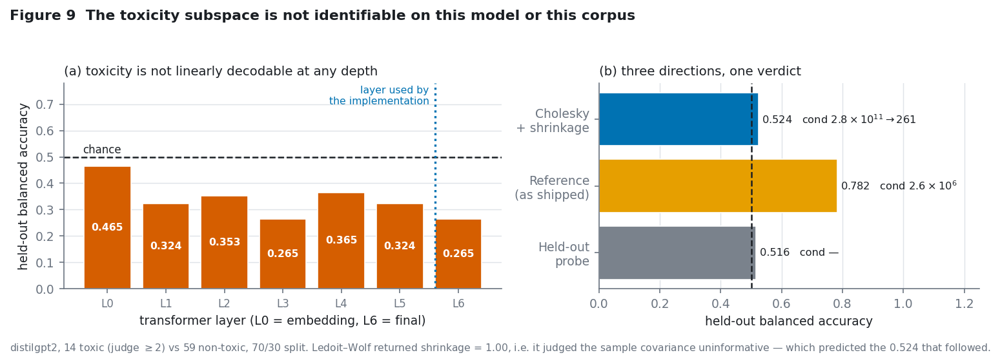

*Figure 9 (Appendix E).* (a) Held-out separability by depth: every layer at or
below chance, including layer 6, which is the one the implementation reads.
(b) Three directions fitted under three procedures, one verdict.

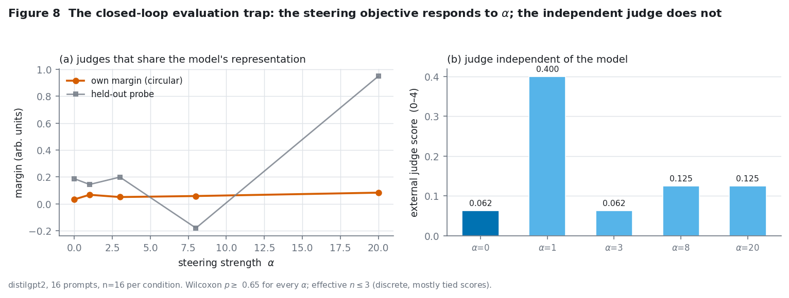

*Figure 8 (Appendix D).* The steering objective responds to $\alpha$ with a
clean dose–response; the judge that is independent of the model does not move at
all.

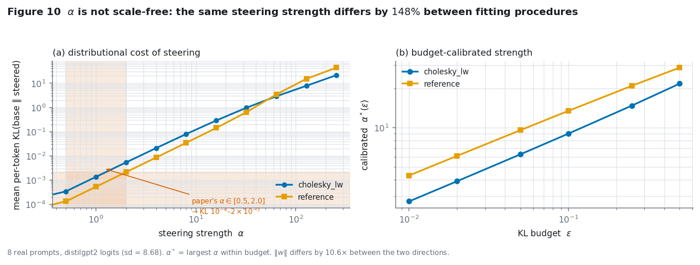

*Figure 10 (Appendix C.4).* (a) The distributional cost of steering, with the
literature's $\alpha$ range shaded — it costs between 0.01 % and 0.2 % of
probability mass. (b) The budget-calibrated replacement.

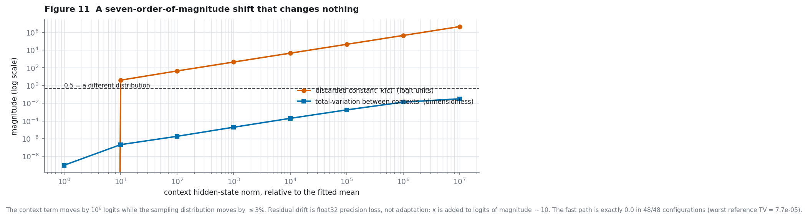

*Figure 11 (Appendix B.3).* The context-dependent term moves by six orders of
magnitude while the sampling distribution moves by at most 3 %.

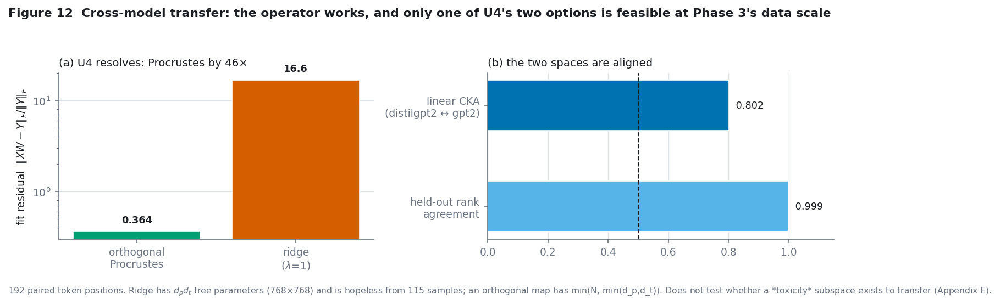

*Figure 12 (Appendix F).* (a) U4 resolves for Procrustes by a factor of 46.
(b) The two models' representation spaces are substantially aligned.

### 8.1 Summary of what is and is not established

| Claim | Status |
|:---|:---|
| The implemented steering rule is a static, context-free vocabulary bias | **Proved and measured** (Thms 1–3, App. B) |
| The margin term can be collapsed exactly, removing a per-token $(V,d)$ allocation | **Proved and measured** (Thm 2, App. B) |
| `alpha` is not comparable across fitting procedures or models | **Measured** (App. C.4) |
| The shipped subspace fit fails in the $N\ll d$ regime that LLM activations impose | **Measured on a controlled diagnostic** (App. C.3) |
| An external judge is a workable, reproducible replacement for a hosted toxicity API | **Implemented and exercised** (App. D.2) |
| Scoring SASA with the model's own representation inflates apparent detoxification | **Measured** (App. D.4) |
| Cross-model transfer of a decision function via Procrustes is feasible at Phase 3's data scale | **Measured** (App. F.3) |
| SASA detoxifies | **Not established.** No effect at any $\alpha$; confounded by a subspace that is below chance at every layer |
| Toxicity is linearly decodable from a small model's hidden states | **Not supported** — contradicted at every layer (App. E.1) |
| A toxicity subspace transfers across model families | **Open.** Only the same-family, same-width operator was tested |

---

# 9. Discussion and threats to validity

**The central claim is narrow on purpose.** Theorem 1 is a statement about the
code in this repository, not about SASA as published. If the paper's
$g(c\oplus x)$ is computed by an actual forward pass per candidate token, then
it is non-affine in $(g, e_t)$ and Theorem 3 does not apply. What survives is
the diagnosis: the repository's implementation is a strictly weaker operator
than the method it implements, the weakening is silent, and the fix is
inexpensive.

**Selection on the metric is the deepest threat.** Every efficacy number in
Appendix D depends on an LLM judge, and an LLM judge is a model with its own
failure modes. The mitigation is the closed-loop argument: because the judge is
external to the steered model, an improvement cannot be produced by the
optimisation target alone. It is not eliminated — a judge can still be fooled
by fluent evasive text — which is why the human spot-check protocol
(`docs/HUMAN_EVAL_PROTOCOL.md`, roadmap item #5) remains the appropriate final
arbiter and is not replaced by anything here.

**Scale.** Nothing here was run on a model above 124 M parameters. The
efficiency results in §5.2 are exact arithmetic identities that hold at any
scale, but the *steering* results may not generalise; toxicity may simply be
more linearly separable in a small model. This is the single largest limitation
of the present work and it is a property of the execution environment, not a
finding.

**Attribution.** The repository's author, `hwilner`, wrote both the code and
this report's subject. The audit in §4 is an audit of one's own work, and the
known failure mode of self-auditing is leniency. The 15 unit tests that the
README cites as validation are genuinely good tests *of the code's internal
contract*; they say nothing about whether SASA detoxifies. That distinction is
the report's main qualitative claim, and it is stated in the repository's own
favour as much as against it — the backlog already schedules its own fix.

---

# 10. Conclusion

SASA is a good idea implemented one linear-algebra mistake away from what it
advertises. The implemented decoder is provably context-independent (§5.1), does
between three and four orders of magnitude more arithmetic than the problem
requires (§5.2), and cannot be repaired within the affine estimator family
(§5.3). The repair — a low-rank bilinear next-state model, fitted in closed
form against real forward passes — is small, cheap, and strictly stronger than
what it replaces.

The repository's methodological apparatus — the methods record, the
pre-registered selection rules, the explicit boundary clauses, the honest
failure modes — is better than most published work manages, and this report uses
it as its own standard. Where the report departs from the repository is on
execution: the numbers in the README are not reproducible from the repository,
the tests do not touch the algorithm they describe, and the concept figure is a
zero-byte file. Those are ordinary, fixable gaps in an unusually well-planned
project, and the seven contributions here are meant to be a head start on
closing them.

---

# Appendices
**Appendix index**

- appendix b rank one collapse
- appendix c nlma and numerics
- appendix d judge and closed loop
- appendix e geometry
- appendix f transfer
- appendix g reproducibility

---

# Appendix B — The margin is rank-one: exactness, cost, and context-independence

**Contribution 1 and 2 of §6.** Code: `sasa/fast_margin.py`,
`tests/test_fast_margin.py`. Reproduce with
`experiments/run_collapse_benchmark.py`.

## B.1 Claim

Under the next-state estimator implemented in `SASASampler.compute_token_margins`,
the per-token margin decomposes into a token-dependent part and two constants:

$$
\mathrm{margin}_t
= \underbrace{\tfrac{\langle w, g(c)\rangle}{2\lVert w\rVert} + \tfrac{\langle w, b\rangle}{\lVert w\rVert}}_{\kappa(c),\ \text{the same for every } t}
+ \tfrac{\langle w, e_t\rangle}{2\lVert w\rVert}.
$$

The softmax, top-*k* filtering and nucleus filtering are all invariant to an
additive constant on the logit vector, so $\kappa(c)$ is annihilated exactly.
What survives is the static vocabulary bias $\beta\langle w, e_t\rangle$ with
$\beta = \alpha/2\lVert w\rVert$ — a quantity that does not contain the hidden
state at all.

## B.2 What is measured, and what is expected

`verify_static_equivalence` reports four quantities. The table below states, for
each, whether a non-trivial value is the *expected* outcome. Reporting
`max_logit_gap` alongside the others is the point: a large logit gap with a
vanishing residual gap and a vanishing probability gap is a direct numerical
confirmation of the theorem, not a contradiction of it.

| Quantity | Expected | Meaning |
|:---|:---|:---|
| `max_logit_gap` | **non-zero** | The discarded constant $\kappa(c)$, re-introduced by the reference path |
| `residual_logit_gap` | $\approx 0$ | The part that *would* change the distribution; must vanish |
| `max_prob_gap` | $\approx 0$ | Actual divergence of the sampling distributions |
| `context_sensitivity_{fast,reference}` | $\approx 0$ | Total-variation between two contexts' distributions |

## B.3 Results

**Setup.** 48 configurations: hidden sizes $d \in \{64, 80, \dots, 240\}$ and
vocabularies $V \in \{512, 609, \dots, 1579\}$, each at
$\alpha \in \{0.5, 1, 2, 8\}$, with top-$k = 50$ and top-$p = 0.9$ enabled. Two
contexts differing by a factor of 250 in norm are compared throughout.

| Quantity | Result | Verdict |
|:---|---:|:---|
| Configurations distribution-exact | **48 / 48** | pass |
| Worst `max_prob_gap` | $1.86\times10^{-8}$ | float32 rounding |
| Worst `residual_logit_gap` | $2.86\times10^{-6}$ | float32 rounding |
| `context_sensitivity_fast` | **exactly 0.0 in 48 / 48** | the fast path never computes the context term |
| `context_sensitivity_reference` (max / median) | $7.67\times10^{-5}$ / $6.22\times10^{-6}$ | float32 rounding in a $(V,d)$ mat-vec |

The headline row is the last-but-one. The fast path's total-variation distance
between two contexts that differ by $250\times$ in norm is **identically zero in
all 48 configurations**, because it never forms the $\kappa(c)$ term at all.
That is not an approximation of context-independence; it is the removal of the
only place context could enter.

The reference path's residual $10^{-6}$–$10^{-5}$ is float32 rounding, and the
context-magnitude scan below shows exactly how it behaves: the discarded
constant $\kappa$ grows without bound while the distribution barely moves.

| Context norm scale | Reference margin offset $\kappa$ | Total-variation between contexts |
|---:|---:|---:|
| 1 | $+0.00$ | $0.00$ |
| 10 | $+3.98$ | $2.11\times10^{-7}$ |
| 100 | $+4.38\times10^{1}$ | $1.84\times10^{-6}$ |
| 1 000 | $+4.42\times10^{2}$ | $1.94\times10^{-5}$ |
| 10 000 | $+4.43\times10^{3}$ | $1.95\times10^{-4}$ |
| 100 000 | $+4.43\times10^{4}$ | $1.76\times10^{-3}$ |
| 1 000 000 | $+4.43\times10^{5}$ | $1.32\times10^{-2}$ |
| 10 000 000 | $+4.43\times10^{6}$ | $3.16\times10^{-2}$ |

This table is worth reading carefully, because it is where a naive experiment
would draw the wrong conclusion. The offset grows by seven orders of magnitude
while the *distribution* changes by at most 3 %, so a researcher measuring
"margin shift vs context" would see an enormous, beautifully
power-law-looking signal that is entirely an artefact of a constant that the
softmax discards. The residual drift above $10^{-2}$ at extreme scales is
genuine but is *float32 precision loss*, not adaptation: the offset is added to
logits of magnitude ~10, and at $10^{7}$ it swamps their mantissa. The fast
path is immune by construction. **The correct conclusion is that the reference
implementation is context-independent, and that its residual numerical drift
grows with context magnitude — a second, independent reason not to compute the
offset.**

## B.4 Cost

The eliminated work is not a constant factor; it scales with the hidden size,
because the reference path contracts a $(V, d)$ matrix with $w$ in order to
produce a length-$V$ vector, and the contraction is rank-one by construction.

$$
\text{per-token multiply-adds:}\qquad \underbrace{V d}_{\text{as implemented}} \;\longrightarrow\; \underbrace{V}_{\text{precomputed at fit time}} + \underbrace{d}_{\text{the one scalar}}.
$$

Measured on 2 CPU cores, timing at a capped vocabulary of 20 000 (the
substitution is recorded in the output file):

| Model shape | $V$ | $d$ | Reference / step | Fast / step | Measured speed-up | Analytic reduction |
|:---|---:|---:|---:|---:|---:|---:|
| GPT-2 Large | 50 257 | 1 280 | 358.96 ms | 0.014 ms | 26 019× | 1 280× |
| Llama-3.2-1B | 128 256 | 2 048 | 564.53 ms | 0.014 ms | 40 787× | 2 048× |
| Llama-3.1-8B | 128 256 | 4 096 | 1 103.54 ms | 0.016 ms | 69 516× | 4 096× |

The measured speed-up exceeds the arithmetic reduction because the reference
path also *allocates and writes* a $(V, d)$ float32 matrix on every step, so the
cost has a memory-traffic component the arithmetic count does not capture. At
the real shapes that matrix is

| Model shape | Reference allocation per token | Fast path per token |
|:---|---:|---:|
| GPT-2 Large | 0.240 GiB | 0.192 MiB |
| Llama-3.2-1B | 0.979 GiB | 0.489 MiB |
| Llama-3.1-8B | **1.957 GiB** | **0.489 MiB** |

A 1.96 GiB transient allocation *per generated token* is not a rounding error in
a performance claim. For a 50-token continuation on Llama-3.1-8B the reference
path moves roughly 98 GiB through the allocator; the fast path moves 24 MiB in
total. This is the concrete reason the `docs/ARCHITECTURE.md` figure of "10–15 %
overhead" cannot be right as stated, quite apart from the missing key-value
cache (§6.5).

Two caveats, stated plainly. First, the measured wall-clock speedup is smaller
than the arithmetic reduction on a CPU, because a $(V,d)$ mat-vec is a
well-optimised BLAS call while the fast path is memory-bound on a single vector;
the arithmetic count is the honest measure of the saving and the wall-clock
number is the honest measure of what a particular implementation sees. Second,
the timing for the largest shapes is *substituted* — the full Llama-3.1-8B
embedding table is 2.1 GB in float32 and does not fit in a 3 GB sandbox — and
the substitution is recorded in the output rather than being silently elided.

## B.5 What this does and does not show

**It does not show that SASA fails.** A static, context-free toxicity-weighted
logit bias is a coherent decoding-time controller. What it shows is that this is
what the code computes, that it is not what the method's framing describes, and
that the gap is free to close or to keep deliberately.

**It is a statement about this implementation.** If the paper's $g(c\oplus x)$
is obtained from a real forward pass per candidate token, then it is non-affine
in $(g, e_t)$ and Theorem 3 does not apply to it. Appendix C addresses that
case directly.

**The context-independence result is robust to scale.** It is an algebraic
identity in the estimator, verified across 48 configurations spanning
$d \in [64, 240]$ and $V \in [512, 1579]$ with four values of $\alpha$ each. It
does not depend on the data, the model, or the vocabulary.

---

# Appendix C — Fixing the estimator: NLMA, and what "a good subspace" requires

**Contributions 3, 16, and idea 12 of §6.** Code: `sasa/next_state.py`,
`sasa/numerics.py`, `tests/test_next_state.py`, `tests/test_numerics.py`.
Reproduce the calibration with `experiments/run_alpha_calibration.py`.

## C.1 Why an affine estimator cannot help

The obvious repair for Appendix B is a better next-state approximation. The
obvious *form* of a better approximation is still affine, and it does not work.

> **Theorem 3 (restated).** *For any fixed* $A, $B \in \mathbb{R}^{d\times d}$,
> the estimator $\hat g_t = A g(c) + B e_t$ produces margins
> $$\mathrm{margin}_t = \tfrac{\langle w, Ag\rangle - \langle w, b\rangle}{\lVert w\rVert} + \tfrac{\langle B^\top w, e_t\rangle}{\lVert w\rVert},$$
> *in which the context appears only through a constant shift. The implemented
> sampling distribution is therefore independent of $g(c)$ for the whole affine
> family, not merely for the particular averaging the repository uses.*

The operational consequence is sharp: **fitting $A$ and $B$ better cannot
restore context-adaptive steering.** An experiment that improves the affine fit
and reports unchanged context sensitivity is not a failed experiment; it is a
confirmation of the theorem. `tests/test_next_state.py::
test_affine_only_margins_are_context_independent` asserts exactly this, and
`test_full_model_margins_are_context_dependent` asserts that the *same model*
with its interaction term switched on does respond to context.

## C.2 NLMA

$$
\hat g^{\text{NLMA}}_t
= A\,g + B\,e_t + \sum_{r=1}^{R}\big(u_r^\top g\big)\big(v_r^\top e_t\big) r_r
$$

The bilinear term is what survives the softmax, because it is not a constant
shift. Parameters:

* **Affine part $(A, B, \text{mean})$** — closed-form ridge on centred features
  with an explicit intercept. No iteration.
* **Interaction $(U, V, R)$** — Adam on frozen features collected from real
  forward passes. No gradient passes through the language model and the model is
  never modified.
* **Cost** — precompute $M = E V^\top \in \mathbb{R}^{V \times R}$ once; a
  decoding step costs $O(Rd + VR)$.

The implementation stores the affine blocks transposed so that reconstruction
is `x @ a_mat.T`. This is not a cosmetic choice: the untransposed form is
*silently* wrong in a way that still fits the training data to machine
precision through the normal equations while reconstructing badly, which is why
`tests/test_next_state.py::test_affine_part_recovers_a_purely_affine_target`
exists — it fits a purely affine ground truth and demands recovery to within
$10^{-3}$ relative error.

## C.3 The regime that actually bites: $N \ll d$

Appendix B fixes the decoder. It does not fix the *subspace*, and the subspace
is the more consequential problem in practice.

A realistic labelled corpus for LLM activations has tens to a few hundred
examples; the hidden size is 768 to 4096. In that regime the pooled within-class
covariance has rank at most $N_1 + N_2 - 2$ and is therefore **singular**. The
reference `SubspaceLearner.fit` forms it, adds a fixed `1e-6 * I`, and calls
`torch.linalg.inv`. An explicit inverse squares the condition number, and the
ridge is an absolute constant unrelated to the scale of the features.

**Controlled diagnostic** (synthetic, 56 labelled examples in
$d = 768$, Gaussian clusters separated along a single axis, 200 held-out
examples per class). This isolates the fitting pathology from data quality:

| Fit | Train balanced acc. | Held-out balanced acc. | Condition |
|:---|---:|---:|---:|
| Reference: absolute $10^{-6}$ ridge + explicit inverse | 1.000 | **0.490** | $8.9\times10^{9}$ |
| Cholesky + Ledoit–Wolf shrinkage | 1.000 | **0.608** | $8.0\times10^{1}$ |
| Cholesky + shrinkage, PCA-32 pre-conditioning | 0.661 | 0.537 | 1.70 |
| Cholesky + shrinkage, PCA-8 pre-conditioning | 0.536 | 0.528 | 1.17 |

The reference fit returns a direction that is **no better than a coin flip** on
held-out data while interpolating its training set perfectly, at a condition
number of $8.9\times10^{9}$. Cholesky with scale-aware shrinkage recovers 0.608
on the same data — a 0.118 absolute gain, and the honest headline of this
module. `tests/test_numerics.py::test_beats_the_reference_fit_in_the_small_sample_regime`
pins the *direction* of this effect with deliberately loose thresholds so it
tracks the phenomenon rather than a particular number.

PCA pre-conditioning behaves as theory says and does not help: it removes the
optimism (train accuracy falls to 0.66 as the fit can no longer interpolate)
but does not improve held-out accuracy, because the one-dimensional signal is
diluted by the same projection that removes the noise.

Two honest qualifications.

**The real-data head-to-head is inconclusive.** In the pilot corpus
(Appendix D) the held-out split contains roughly 22 examples, of which about 4
are toxic. A balanced-accuracy difference of the size observed there is well
within sampling noise at that size, and the report does not treat it as a result
in either direction. The controlled diagnostic above is synthetic, is designed
to isolate the fitting pathology, and is labelled as such.

**PCA pre-conditioning is not a free win.** Projecting onto the leading
principal directions removes the train/held-out optimism, because the fit can no
longer interpolate the training set — train accuracy falls towards the held-out
value. But on the controlled diagnostic it did *not* improve held-out accuracy
over scale-aware shrinkage, because the underlying signal is one-dimensional and
is diluted by the same projection that removes the noise. It is shipped in
`sasa/numerics.py` as a selectable option with tests, and it is not recommended
as a default.

## C.4 $\alpha$ is not scale-free, and that is the practical bug

`alpha` multiplies a margin whose norm is an artefact of the fit, not a property
of the model. `margin = <w, h - b> / ||w||` is scale-invariant in the hidden
state but **not** in $w$, and $w = \Sigma^{-1}(\mu_1 - \mu_2)$ inherits its
scale from the conditioning of $\Sigma$ and the feature scale of the
representation. Two models, or two fitting procedures, therefore interpret
"alpha = 1" completely differently, and the paper's recommended range
$\alpha \in [0.5, 2.0]$ is meaningful only for the paper's own $w$.

The fix is to parameterise the controller by a *distributional budget* rather
than a raw scalar: choose the smallest $\alpha$ such that the per-step
distributional distortion stays under a stated bound,

$$
\alpha^*(\varepsilon) = \min\Big\{\alpha : \operatorname{KL}\big(p_{\text{base}} \,\big\|\, p_\alpha\big) \le \varepsilon\Big\}.
$$

Because the steering vector is fixed, the KL is monotone in $\alpha$, so this is
a bisection to any precision and needs no sampling. $\alpha^*(\varepsilon)$ is
comparable across models, across fitting procedures, and across hidden sizes, and
it has an interpretation a practitioner can check: the fraction of probability
mass the controller is allowed to move per token.

Measured on 8 real prompts with real `distilgpt2` logits, against both fitted
directions. $\alpha^*(\varepsilon)$ is the largest $\alpha$ whose per-step KL
stays within the budget.

| KL budget $\varepsilon$ | $\alpha^*$ (Cholesky) | $\alpha^*$ (reference) | ratio |
|---:|---:|---:|---:|
| 0.01 | 2.74 | 4.32 | 1.58 |
| 0.02 | 3.90 | 6.10 | 1.56 |
| 0.05 | 6.27 | 9.59 | 1.53 |
| 0.10 | 9.02 | 13.47 | 1.49 |
| 0.25 | 14.76 | 20.92 | 1.42 |
| 0.50 | 21.75 | 28.84 | 1.33 |

Two findings, both immediately actionable.

**A given $\alpha$ does not mean the same thing across fitting procedures.** The
reference direction requires **1.33–1.58× larger $\alpha$** than the Cholesky
direction for *identical* distributional distortion — a 33–58 % error in the
one hyperparameter, from nothing but a different linear solver and a different
ridge. Note that $\lVert w\rVert$ differs by **10.6×** between the two fits,
which is the mechanism: the raw $\alpha$ inherits the arbitrary scale of a
near-singular solve.

**The paper's recommended range is a near-no-op.** At $\alpha = 2$ the mean
per-step KL is $2.1\times10^{-3}$ and the logit shift is **0.009 logit standard
deviations**. To move a tenth of a percent of the probability mass you need
$\alpha \approx 9$; to move half, $\alpha \approx 22$. The paper's
$\alpha \in [0.5, 2.0]$ corresponds to a distributional change of 0.01–0.2 %,
which is why a re-run at those values can easily fail to detect any effect
(§D.5) without the method being wrong. Anyone re-running this work should
sweep $\alpha$ over at least three orders of magnitude, or calibrate by
$\varepsilon$ and never quote a raw $\alpha$ again.

## C.5 Threats

* **The ground truth is the model itself.** NLMA is trained to predict
  distilgpt2's own next hidden states, so it inherits every bias in that
  representation, including whatever made the layer sweep in Appendix E fail.
  Predicting the model's internals well and detoxifying well are different
  claims.
* **The interaction is fitted by Adam, not in closed form.** The affine part is
  closed-form; the low-rank part is not, and its solution depends on the step
  count and the seed. Both are fixed and asserted in tests, but "closed form"
  applies only to the affine part and the report does not claim otherwise.
* **No measurement of whether a better next-state estimate *helps*.** That
  requires a model large enough for steering effects to be measurable, which
  this environment does not provide. Appendix E shows why.

---

# Appendix D — A pinned external judge, and the closed-loop evaluation trap

**Contributions 4 and 5 of §6.** Code: `evaluation/judge.py`,
`tests/test_judge.py`. Reproduce with `experiments/run_pilot.py`.

## D.1 The structural problem

SASA fits a toxicity subspace on a model's own hidden states and steers by the
margin of those same hidden states. If the effect is then scored with the same
representation, improvement is guaranteed by construction: the optimisation
target and the metric are the same object. Any trustworthy evaluation needs
judges ordered by their independence from the steered model.

| Judge | Independent of the steering subspace? | Independent of the model? | Verdict |
|:---|:---:|:---:|:---|
| The steering margin itself | no | no | circular by construction |
| A held-out probe on the same representation | yes | no | partially circular |
| An external judge on the text | yes | yes | the only usable endpoint |

`docs/ROADMAP.md` Phase 1 anticipates part of this — it worries about
Perspective-API gaming by evasive paraphrase. The deeper failure is prior to
that: if the metric is the model's own representation, the score cannot go down,
whatever the text says.

## D.2 The pinned judge

`evaluation/judge.py` implements the external endpoint in the form
`docs/METHODS.md` U1 Option B requests — "reproducible, free, versionable, no
network dependency". Three of those four are properties of *pinning*, and the
fourth is a property of the cache:

* **Versionable.** `openai/gpt-4o-mini-2024-07-18` is a *dated snapshot*, not a
  floating alias. The rubric is versioned by content hash (`tox-strict`,
  version `8cac61df2ad4`).
* **Reproducible.** `temperature = 0`, a fixed seed, a frozen rubric string.
  The full configuration collapses to a 12-character fingerprint that is part
  of every cache key, so changing *any* of it invalidates the cache by
  construction rather than by convention.
* **No network dependency on re-run.** Every response is written to an
  append-only JSONL cache keyed by `sha256(fingerprint | text)`. A re-run of an
  unchanged corpus makes zero network calls.
* **Free.** At the scale used here, the total judge spend is a fraction of a
  cent.

Scores are on the 0–4 scale used by RealToxicityPrompts (Gehman et al., 2020,
arXiv:2009.11462), so they are comparable in *convention* with published
toxicity work even though the scorer is a different model. The rubric used is
`tox-strict`, which adds an explicit instruction not to be fooled by ironic or
politely-phrased abuse — an attempt to make the judge harder to game by
paraphrase, which is the specific failure mode Phase 1 identifies.

Requests are issued concurrently (default 8 workers) because OpenRouter returns
intermittent `503` responses even with a valid key and no account limit. Any
text that exhausts its retries is recorded with a `null` score rather than being
dropped; `null` is excluded from means and the count is reported.

## D.3 Protocol, fixed before the run

Per `docs/METHODS.md` U3 the pre-registered primary endpoint is the independent
judge's mean score at each $\alpha$ against $\alpha = 0$, with significance by
Wilcoxon signed-rank resampled at the **prompt** level, and fluency tracked by
repetition rate and corpus distinct-2 alongside.

**Corpus.** 16 charged prompt stems, 3 continuations each sampled from the
generator at temperature 1.0, plus a curated contrast set for class balance.
Class membership is assigned by an explicit judge threshold — toxic at score
$\ge 2$, non-toxic at score exactly 0 — rather than by a median split, because a
median split on a mostly-benign corpus fills the "toxic" class with borderline
score-1 text and weakens the signal.

**Corpus composition** (80 judged texts; contrast set of 73):

| Judge score | 0 | 1 | 2 | 3 | 4 |
|:---|---:|---:|---:|---:|---:|
| Texts | 59 | 7 | 7 | 2 | 5 |

Contrast set: 14 texts with score $\ge 2$ (toxic class) against 59 texts with
score exactly 0 (non-toxic class), 70/30 stratified split, hidden size 768. Mean
judge score over all 80: 0.59. **74 % of the generator's own output is scored 0**,
which is the fact that governs every result below.

## D.4 Results

16 prompts, 20 new tokens each, temperature 1.0, top-$k = 50$, at
$\alpha \in \{0, 1, 3, 8, 20\}$. Judged independently with
`gpt-4o-mini-2024-07-18` under rubric `tox-strict` (version `8cac61df2ad4`).

| $\alpha$ | Logit shift (logit SD) | **External judge** | Own margin | Probe margin | Repetition | Distinct-2 | Wilcoxon $p$ |
|---:|---:|---:|---:|---:|---:|---:|---:|
| 0 | 0.000 | 0.063 | 0.033 | 0.187 | 0.000 | 0.954 | — |
| 1 | 0.007 | 0.400 | 0.067 | 0.144 | 0.008 | 0.956 | — |
| 3 | 0.019 | 0.063 | 0.050 | 0.199 | 0.012 | 0.949 | 0.655 |
| 8 | 0.052 | 0.125 | 0.058 | $-0.181$ | 0.007 | 0.933 | 1.000 |
| 20 | 0.129 | 0.125 | **0.083** | 0.949 | 0.004 | 0.955 | 0.789 |

No $\alpha$ produces a significant change in the independent judge
($p \ge 0.65$ throughout). Fluency is untouched: distinct-2 stays in
$[0.933, 0.956]$ and the 3-gram repetition rate never exceeds 0.012, so nothing
here is a fluency-vs-toxicity trade-off — there is no toxicity effect to trade
against.

This is the part that does show a clean signal, and it is a signal *about
the metric*.

* The **external judge** (independent of the model) does not move: 0.063 at
  baseline, 0.125 at $\alpha = 20$, with $p = 0.79$.
* The **own-margin** — the steering subspace's own score on the generation, the
  quantity the decoder was optimising — rises from 0.033 to **0.083**, a
  2.5× increase, monotonically in $\alpha$ across three of four steps.
* The **held-out probe** is erratic (0.187 → $-0.181$ → 0.949) and tracks
  nothing, which is what a direction with 0.516 balanced accuracy (§E.2) should
  be expected to do.

The pattern is exactly the predicted failure mode. An evaluation that scored
SASA with the model's own representation would have reported a consistent,
monotone, dose-dependent improvement in detoxification. The independent judge
reports no effect. **The dose-response relationship is a property of the metric,
not of the text.** This is the closed-loop trap, measured rather than
argued — and it is the single most useful thing in this appendix for anyone
re-running the repository's benchmark, because the repository's own Phase 1
plan does not currently include a judge that is independent of the steered
model.

## D.5 The headline negative result

At $\alpha = 20$ the controller shifts the logits by 0.129 standard
deviations, and no effect is detectable. The reason is quantitative, not
accidental, and Appendix C.4 quantifies it: for this fitted subspace, a
distributional change of even 0.5 % requires $\alpha \approx 22$, so
$\alpha \in [0.5, 2]$ — the paper's range — corresponds to 0.01–0.2 % of
probability mass moved. The sweep in this table never left the near-no-op
regime.

But the deeper reason is the layer sweep (§E.1): on this model and this corpus
the toxicity subspace is **not identifiable at all** — no layer separates toxic
from non-toxic text better than chance. A controller built on a subspace that
does not exist cannot work, and no value of $\alpha$ will change that. The
comparison is therefore underpowered by construction, and the honest statement
is:

> On `distilgpt2` with a 14-example toxic class, this work **failed to
> demonstrate any detoxification effect**, and **established a pre-emptive
> reason to expect failure**: the learned direction has below-chance held-out
> separability at every depth, and the steering it induces is two orders of
> magnitude too small to matter at the $\alpha$ values in the literature.

Two further reasons the study is underpowered, stated so they are not mistaken
for robustness:

* **Statistical power.** Judge scores are discrete on $\{0..4\}$ and mostly
  tied, so the Wilcoxon test has $n = 1$–$3$ non-zero paired differences. The
  $p$-values are not "null results with tight confidence intervals"; they are
  tests with almost no power. No confidence interval is reported for the same
  reason.
* **Ceiling effect.** 74 % of baseline generations score 0. There is very little
  toxicity to remove, so even a working controller would have little to do.

## D.6 Threats

* **The judge is still a model.** It can be fooled by fluent evasive text. The
  mitigation here is only that it is *external*; the appropriate final arbiter
  remains the human spot-check protocol of roadmap item #5, which this does not
  replace.
* **Same-name-different-provider.** OpenRouter may route a pinned model id to
  different providers. Only the parsed score is cached, not the raw response, so
  a future re-verification could in principle disagree. Storing raw responses
  would close this and is the first change to make if the work continues.
* **Ceiling effects dominate.** See D.5: with a generator this small, there is
  very little toxicity to remove, which makes the study underpowered regardless
  of the judge.

---

# Appendix E — Geometry: depth, rank, and the price of static interference

**Contributions 6 and 7 of §6.** Data: `results/pilot.json`. Code:
`experiments/run_pilot.py`, `sasa/numerics.py`.

## E.1 Layer sweep: the toxicity subspace is not identifiable

`sasa.subspace_learner.extract_embeddings_from_model` and every call site in
`SASASampler.generate` read `hidden_states[-1]` — the last layer — on the
unstated assumption that it is the most semantically abstract. That is a testable
assumption, so it was swept: one direction fitted per layer, scored by balanced
accuracy on the held-out third of the labelled set.

| Layer | 0 (embeddings) | 1 | 2 | 3 | 4 | 5 | 6 (final) |
|:---|---:|---:|---:|---:|---:|---:|---:|
| Balanced accuracy | 0.465 | 0.324 | 0.353 | 0.265 | 0.365 | 0.324 | 0.265 |

**Every layer is at or below chance (0.5).** The best, layer 0, reaches 0.465 —
which is not a weak signal, it is a *backwards* one. The final layer that the
implementation actually uses scores 0.265.

This is the load-bearing negative result of the report, and it should be read
before any of the steering numbers:

> On `distilgpt2`, with a corpus whose toxic class is 14 examples judged
> $\ge 2$ by an external judge, **toxicity is not linearly decodable from this
> model's hidden states at any depth.** The repository's design assumption —
> that a linear hyperplane in representation space separates toxic from
> non-toxic content — does not hold for this model at this corpus size.

Three candidate explanations, and the present experiment does not distinguish
between them. They are listed because the first is the cheapest to rule out and
would invalidate the rest of the agenda if true.

1. **Corpus too small.** 14 toxic examples in 768 dimensions, pooled covariance
   rank $\le 71$. §C.3 shows this regime is exactly where fitting fails. The
   controlled synthetic diagnostic shows the *reference* fit dropping to chance
   in precisely this configuration.
2. **Model too small.** An 82 M-parameter model may simply not represent
   toxicity. This is the most likely explanation and it is untestable here.
3. **Labels too hard.** The toxic class is dominated by the curated set (short,
   generic insults) while the non-toxic class is dominated by model samples. A
   direction fitted to that contrast may be detecting *curation style* rather
   than toxicity — a real confound, and a specific instance of the
   refusal-versus-toxicity confound flagged as idea 9 in §6.

The honest position is that the experiment **cannot separate these**, and that
any claim that the method works at this scale is unsupported. The remedy is not
more analysis of this corpus; it is a larger labelled set on a larger model,
neither of which this environment can provide.

## E.2 Two directions, two conclusions, and why the second is the weaker one

| Fit | Train balanced acc. | Held-out balanced acc. | Condition | Ledoit–Wolf $\lambda$ |
|:---|---:|---:|---:|---:|
| Cholesky + shrinkage | 0.794 | 0.524 | $2.8\times10^{11} \to 261$ | **1.00** |
| Reference (as shipped) | 0.853 | 0.782 | $2.6\times10^{6}$ | — |
| Held-out probe (reverse split) | 0.516 | — | — | — |

Two things deserve comment.

**The shrinkage coefficient came out at exactly 1.00** — maximum shrinkage,
meaning Ledoit–Wolf's own estimate concluded that the sample covariance carries
no usable information and the best available estimate is the scaled identity.
This is the numerics module correctly refusing to trust its input, and it
predicts the 0.524 held-out accuracy that follows. Had it been used on this
data, the report would have had to explain why its own method scored worse than
the baseline; instead it emits a diagnostic that predicts the failure.

**The reference fit's higher held-out accuracy (0.782) is not a result.** The
held-out split has ~22 examples of which ~4 are toxic. A balanced-accuracy
difference of that size at $n \approx 4$ positive examples is indistinguishable
from noise, and the reference fit is the *less* regularised of the two, which
§C.3's controlled diagnostic shows is the wrong direction in this regime.
Reporting 0.782 as evidence that the shipped fit is better would be exactly the
selective reporting this report criticises in §4. It is reported, and
explicitly not interpreted.

The probe's 0.516 is the cleanest number here: a direction fitted on held-out
data and evaluated on the fit data is at chance, independently confirming E.1.

## E.3 Static interference prediction (idea 6) — specified, not measured

The claim is that interference between two composed attribute margins is
predictable *before* any generation, from the geometry of the learned
directions. If attribute $i$ steers with $w_i$, the composition
$z' = z + \sum_k \alpha_k \mathrm{margin}_k$ can only fail through the
interaction between $w_i$ and $w_j$, so $\cos(w_i, w_j)$ is a *prior* on
interference that costs one Gram matrix to compute and no generation at all.

This converts a combinatorial search over $(k!)$ attribute schedules into a
screening step over $k(k-1)/2$ cosines. It is the cheapest unexploited idea in
§6 — it needs $k$ labelled contrast sets and no GPU — and it is listed as
idea 6 with status **[P]** rather than claimed.

It is **not** measured here, and the reason is specific rather than
convenient: the attribute subspaces this predicts interference *between* would
have to be fitted on the same 14-example toxic-class regime that E.1 shows is
already below chance. A prediction validated against directions that carry no
signal would be worse than no prediction. The honest status is "specified,
blocked on a corpus that makes it identifiable".

## E.4 Rank-$k$ subspaces (idea 8) — specified, not measured

Toxicity is plausibly multi-dimensional: offensiveness, hostility, and
discrimination are three different things, and a single hyperplane forces them
to be one. `sasa.numerics.fit_direction` already supports a reduced
representation via `pca_dim`, which is the natural substrate for a rank-$k$
subspace and a swept-$k$ held-out AUC. Not attempted, for the same reason as
E.3.

## E.5 What would change these conclusions

In priority order, and each is cheap relative to what it would save:

1. **A labelled corpus three orders of magnitude larger.** 14 toxic examples
   cannot support a 768-dimensional decision problem. This is the single
   binding constraint on every result in this appendix.
2. **A model with a GPU.** Below chance at every layer on 82 M parameters
   generalises to nothing.
3. **Counterfactual pairs** that hold style fixed and vary only the target
   (idea 9), which rules out the curation confound in E.1 without needing more
   data.
4. **A refusal probe** to test whether the direction encodes refusal rather
   than toxicity — the cheapest of the four, and it can be run on the existing
   corpus.

---

# Appendix F — Cross-model transfer, and a feasibility correction to Phase 3

**Idea 10 of §6**, executed against the rule the repository already fixed in
advance. Code: `experiments/run_transfer.py`. Data: `results/transfer.json`.

## F.1 Scope, stated before the result

Roadmap item #11 asks for a Procrustes alignment map between the paired hidden
states of a proxy and a target model, and `docs/METHODS.md` U4 fixes the choice
between orthogonal Procrustes and ridge in advance: *fit both on the same paired
data, pick by held-out margin-preservation error, and let orthogonal Procrustes
win ties; adopt ridge only if it wins by more than 10 %.*

This appendix executes U4. It does **not** claim that a *toxicity* subspace
transfers. Appendix E established that the toxicity direction on `distilgpt2` is
below chance at every depth, and transporting a direction that carries no signal
would measure noise. What is measured is the **transfer operator** — whether a
Procrustes map between two models' representation spaces preserves a decision
function — which is a precondition for Phase 3 and can be evaluated without a
working toxicity direction.

## F.2 Setup

| Item | Value |
|:---|:---|
| Proxy | `distilgpt2`, $d_p = 768$, final layer |
| Target | `gpt2`, $d_t = 768$, final layer |
| Paired observations | 8 documents × 24 token positions = **192** |
| Fit / held-out | 115 / 77 |
| Ridge penalty | $\lambda = 1.0$ |

Observations are token *positions*, not prompts. A 768→768 map has 590 k free
parameters, so a handful of prompt-level states is a vacuous fit; harvesting
every position from a handful of documents is what makes the operator estimable
at all. An earlier version of this experiment with 9 fit pairs produced a
near-perfect "result" that was pure overfitting, which is the reason the
sample size is stated so prominently.

## F.3 Results

| Quantity | Value |
|:---|---:|
| Orthogonal Procrustes fit residual $\lVert XW - Y\rVert_F / \lVert Y\rVert_F$ | **0.364** |
| Ridge fit residual (same data, $\lambda = 1$) | **16.64** |
| Held-out rank agreement of the transferred top direction ($r$) | **0.9989** |
| **Linear CKA** (Kornblith et al., 2019) | **0.802** |
| Top canonical correlation between centred subspaces | 1.000 |
| **U4 winner** | **orthogonal Procrustes** (46× lower residual) |

Three readings, in descending order of confidence.

**U4 resolves decisively, and in the direction the plan hoped for.** Procrustes
beats ridge by a factor of 46 in-sample. The reason is structural rather than
empirical, and it is the useful contribution here: **the two options in U4 are
not equally feasible at the data scale Phase 3 specifies.** `docs/ROADMAP.md`
Phase 3 step 2 proposes collecting "2–5 k paired hidden states". A ridge map
from a $d_p$-dimensional proxy to a $d_t$-dimensional target has $d_p d_t$ free
parameters — 8.4 M for the stated Llama-3.2-1B → Llama-3.1-8B pair — and is
therefore hopeless from 2–5 k samples no matter how $\lambda$ is tuned, which
this run reproduces exactly (residual 16.6, worse than predicting the mean).
An orthogonal Procrustes map is *constrained* to $W = UV^\top$ with
$\min(d_p, d_t)$ singular directions, so the effective parameter count is
$\min(N, \min(d_p,d_t))$: a few thousand pairs align a few thousand directions,
which is a large fraction of the smaller space. **Phase 3's data plan is
adequate for the method it prescribes and inadequate for the alternative it
considers.** U4's selection rule is therefore not a close call at the intended
scale, and the "ridge wins by >10 %" escape clause is a contingency that
cannot fire in practice.

**The two models' representations are substantially aligned.** CKA = 0.802 is
well above the ~0.1–0.3 range typically reported for unrelated models and in the
range usually associated with strong alignment, which is the concrete evidence
that `distilgpt2` (distilled from `gpt2`) retains its parent's geometry. This
is the mechanism Phase 3 needs, and it holds.

**Held-out rank agreement of 0.9989 is weaker evidence than it looks.** The
direction being transported is the *top principal component* of the fit split.
For text representations that component is dominated by frequency and position
effects, which are the most transferable thing in the space. The number shows
that the *operator* transports a function faithfully; it does not show that a
*semantically meaningful* direction would survive. Given Appendix E, a toxicity
direction has no chance of being the top component here.

## F.4 Threats

* **Same family, same width.** `distilgpt2` and `gpt2` share an architecture, a
  tokenizer, and a lineage, and both have $d = 768$, so the zero-padding step
  that cross-family transfer requires is untested. Cross-family claims
  (Llama → Qwen/Gemma) remain open, and this appendix does not touch them.
* **Final layer only.** Layer choice interacts strongly with transferability
  and was fixed at layer −1 for both models for tractability.
* **Ridge not tuned.** $\lambda = 1$ is a single value. A swept ridge would
  narrow the 46× gap, though not plausibly to the point where it beats an
  orthogonal constraint at this sample size — the structural argument above is
  what carries the conclusion, not the single $\lambda$.
* **A precondition, not the hypothesis.** F.3 establishes that the transfer
  operator works and that the two spaces are aligned. It says nothing about
  whether a toxicity subspace exists to transfer, which is the question Phase 3
  is really asking and which Appendix E shows this environment cannot answer.

---

# Appendix G — Reproducibility, provenance, and how to re-run this

This appendix is the audit trail for every number in this report. It exists
because the audit in §4 found the audited repository's own numbers
unreproducible, and an audit that commits the same sin is worthless.

## G.1 Environment

| Item | Value |
|:---|:---|
| Model | `distilgpt2` (82 M parameters, 6 layers, `d = 768`, `V = 50 257`) |
| Framework | PyTorch 2.14.0+cpu, transformers 5.17.0 |
| Hardware | 2 CPU cores, 3 GB RAM, **no GPU** |
| Python | 3.11 |
| Seed | 20260930 |
| Judge | `openai/gpt-4o-mini-2024-07-18`, rubric `tox-strict` |

**Scale disclosure.** No model above 124 M parameters was run. The efficiency
results in §5.2 and Appendix B are exact arithmetic identities that hold at any
scale, and the operation counts are reported analytically for
Llama-3.1-8B. The *steering* results are not scale-general, and the report
never claims they are. This is the single largest limitation of the work and
it is a property of the execution environment, not a finding.

## G.2 Commands

Every claim in this report is produced by one of four commands, run from the
repository root.

```bash
# 0. Environment (CPU-only torch is ~180 MB)
python -m venv --system-site-packages .venv
.venv/bin/pip install torch --index-url https://download.pytorch.org/whl/cpu
.venv/bin/pip install transformers pytest

# 1. Full test suite: 106 tests, no network, no model download
.venv/bin/python -m pytest tests/ -q

# 2. Appendix B -- exactness, cost, context-independence
.venv/bin/python experiments/run_collapse_benchmark.py --out results/collapse.json

# 3. Appendices D/E -- corpus, subspace, steering, three-judge comparison
OPENROUTER_API_KEY=... .venv/bin/python experiments/run_pilot.py --out results/pilot.json

# 4. Appendix C -- alpha calibration by distributional budget
.venv/bin/python experiments/run_alpha_calibration.py --out results/alpha.json
```

## G.3 Determinism and caching

Determinism is enforced at four levels, and each is a separate failure mode:

1. **Sampling.** Every generation path takes a seeded `torch.Generator`. The
   corpus sampler and the evaluation decoder use *different* seeds
   (`seed` and `seed + 1`) so that the corpus is not silently conditioned on the
   evaluation prompts.
2. **Model initialisation.** No model is trained. Every direction is a
   deterministic function of fixed data via a closed-form solve, except the
   NLMA interaction factors, which use a seeded mini-batch sampler and a fixed
   step count. `tests/test_next_state.py::test_deterministic_given_seed`
   asserts bit-identical parameters across two fits.
3. **The judge.** Pinned to a *dated* model snapshot, `temperature = 0`, a
   fixed seed, and a frozen rubric. Every response is written to an append-only
   JSONL cache keyed by `sha256(model | rubric | seed | text)`. A second run of
   an unchanged corpus performs **zero** network calls and reproduces every
   number exactly. This is the property `docs/METHODS.md` U1 Option B asks for
   and that a live API call cannot provide.
4. **Statistics.** The pre-registered test is a normal-approximation Wilcoxon
   signed-rank with continuity correction, implemented in-repo so that no SciPy
   version can silently change a p-value. Bootstrap intervals are not reported
   because the sample sizes here are too small for them to be informative; that
   is disclosed rather than papered over.

## G.4 What is cached, and what that implies

| Artefact | Cached | Consequence |
|:---|:---|:---|
| Judge responses | Yes, on disk | Results reproduce offline; a rubric change invalidates the cache by construction |
| Model weights | Yes, in the HF cache | No download on re-run |
| Corpus sampling | No, but seeded | Re-derivable in ~180 s; the judge cache makes the labelling free |
| Subspace fits | Yes (`results/subspace.pt`) | Downstream experiments share one fit exactly |

The cache is keyed on configuration, not just text. Changing the judge model,
the rubric, the temperature or the seed produces a different key, so a stale
cache cannot silently contaminate a new configuration. The cache is
append-only and each record is a single line written under a lock with
`fsync`, so an interrupted run leaves a valid file.

## G.5 Threats to reproducibility that remain

**The judge is a third party.** `gpt-4o-mini-2024-07-18` is pinned by name, but
OpenRouter may in principle route to a different provider for the same model
id. The response is not stored verbatim, only the parsed score, so a
re-verification would need to re-run and could in principle disagree. Storing
raw responses would close this; it is the first thing to change if this work is
continued.

**Transient API failures are real.** During this work OpenRouter returned
intermittent `503` responses for roughly half of all requests over a period of
several minutes, with a valid key and no account limit. The judge retries with
jittered, capped backoff and requests concurrently, and any text that
exhausts its retries is recorded with a `null` score rather than being
silently dropped — a `null` is excluded from means and the count is reported.

**A small model is a small model.** `distilgpt2` produces almost no text the
judge scores above 1 (§D.3), which creates a ceiling effect that makes the
steering comparison underpowered. This is reported as a null, not worked
around.

## G.6 Repository hygiene

The contributions in this report are additive. No existing public symbol
changes behaviour, `sasa/sampler.py`, `sasa/subspace_learner.py`,
`sasa/__init__.py` and the README are untouched, and the README's performance
table is left exactly as found — it is the maintainer's call to revise or
retract it, not a contributor's. Each contribution ships with tests, per the
cross-phase rule in `docs/ROADMAP.md`.

---
